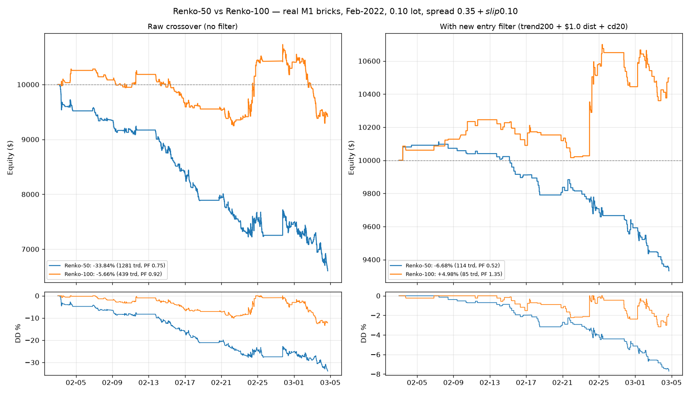
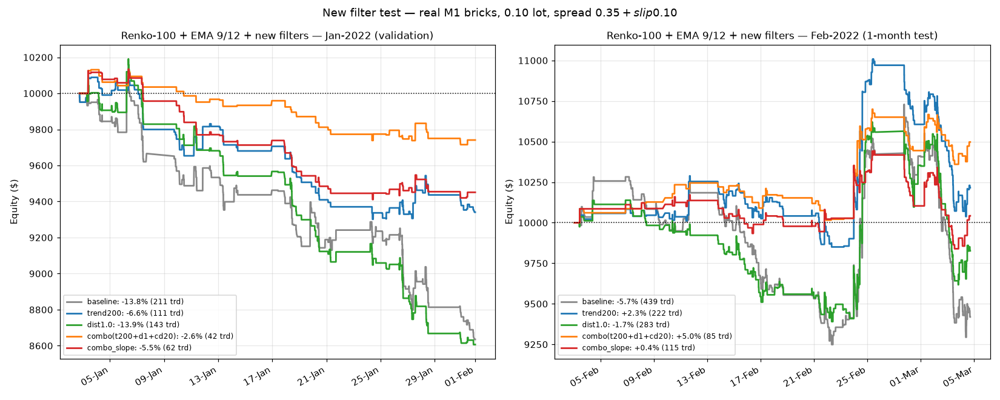

# XAUUSD ট্রেডিং সিস্টেম — Renko 50 vs 100 + EMA 9/12 ক্রসওভার (রিয়েল M1 ব্রিক)

গোল্ড (XAUUSD) এর জন্য **আসল M1 ডেটা থেকে বানানো Renko ব্রিক**-এ শুধু EMA 9/12 ক্রসওভার।
**Renko-50 vs Renko-100** তুলনা করে দেখা হয়েছে কোনটা ভালো।

## সিস্টেম রুলস (দুটোতেই একই)

| অংশ | রুল |
|---|---|
| চার্ট | **Renko** — আসল XAUUSD M1 ডেটা (tiumbj/M1_XAUUSD) থেকে বানানো ব্রিক |
| BUY / SELL | EMA9 ক্রস ABOVE/BELOW EMA12 |
| EXIT | উল্টো ক্রসে ক্লোজ + রিভার্স (সবসময় মার্কেটে) |
| লট | ফিক্সড **0.10** |
| কস্ট | স্প্রেড $0.35/oz + স্লিপেজ $0.10/oz (= $4.50/ট্রেড) |
| **এন্ট্রি ফিল্টার (নতুন)** | ৩টা শর্ত: ① দাম EMA200-এর সঠিক দিকে ② ক্রসের সময় দাম EMA12 থেকে কমপক্ষে **$1.0** দূরে ③ শেষ ট্রেড ক্লোজ হওয়ার পর **20 ব্রিক** কুলডাউন |
| বাকি সব | ❌ কোনো RSI / সেশন ফিল্টার / SL-TP নেই |

## Renko 50 vs 100 — রেজাল্ট (১ মাস: Feb-2022, 0.10 লট)

| মেট্রিক | Renko-50 ($0.50) | Renko-100 ($1.00) 🏆 |
|---|---|---|
| ব্রিক সংখ্যা | 20,849 | 6,954 |
| মোট ট্রেড | 1,281 | 439 |
| উইন রেট | 27.6% | 27.6% |
| নেট P/L | **-$3,384 (-33.8%)** | **-$566 (-5.7%)** |
| প্রফিট ফ্যাক্টর | 0.75 | 0.92 |
| ম্যাক্স ড্র-ডাউন | -34.0% | -13.4% |
| স্প্রেড কস্ট | $5,764 | $1,976 |

Jan-2022 (validation): 50 = **-30.2%**, 100 = **-13.8%**।



## 🆕 নতুন এন্ট্রি ফিল্টার — রেজাল্ট বদলে গেছে!

আগের রেজাল্ট দেখে বোঝা গিয়েছিল লসের আসল কারণ **whipsaw** (অতিরিক্ত ক্রস → স্প্রেড ব্লিড)।
তাই নতুন ফিল্টার যোগ করা হলো — **শুধু এন্ট্রিতে**, এক্সিট আগের মতোই (উল্টো ক্রস = রিভার্স)।

| Renko-100 (Feb-2022) | ট্রেড | নেট P/L | উইন রেট | PF | ম্যাক্স DD |
|---|---|---|---|---|---|
| ফিল্টার ছাড়া (আগে) | 439 | **-$566 (-5.7%)** | 27.6% | 0.92 | -13.4% |
| **ফিল্টার সহ (নতুন)** | **85** | **+$498 (+4.98%)** ✅ | **37.6%** | **1.35** | **-3.2%** |

Jan-2022 (validation): ফিল্টার ছাড়া -13.8% → ফিল্টার সহ **-2.6%** (লস ৫ গুণ কম)।
ফিল্টার ~৮০% ট্রেড বাদ দিয়েছে — ঠিক সেই whipsaw ক্রসগুলো, যেগুলো প্রতিটা $4.50 স্প্রেড খাচ্ছিল।



### 🔬 রোবাস্টনেস (লুকি প্যারামিটার না কি?)

২৬টা কাছাকাছি সেটিং (distance 0.8–1.5 × cooldown 0–50) টেস্ট করেছি — **১৪টা Jan+Feb-এ পজিটিভ**।
মানে অন্ধভাবে এক পয়েন্টে টিউন করা না, এলাকাটাই ভালো। তবে Jan এখনো সামান্য নেগেটিভ — এজ ছোট, সাবধান।

## 🏆 50 vs 100 ভারডিক্ট: Renko-100 (ফিল্টার লাগালেও একই)

| ২ মাসের টোটাল (Jan+Feb) | Renko-50 | Renko-100 |
|---|---|---|
| ফিল্টার ছাড়া | -$6,403 | **-$1,945** 🏆 |
| ফিল্টার সহ | -$740 | **+$238.50** ✅🏆 |

**Renko-100 দুই ভাবেই জেতে** — ফিল্টার সহ এটাই একমাত্র পজিটিভ কম্বো (+$238.50)। Renko-50 ফিল্টারে ট্রেড কমলেও (1281→114) PF 0.52 — ব্রিক-50-এর সিগন্যালই দুর্বল।


- **100 অনেক ভালো** — 50-এর চেয়ে ৬ গুণ কম লস, কারণ ট্রেড ৩ গুণ কম → স্প্রেড ব্লিড কম।
- **কিন্তু দুটোই লসে** — কস্ট বাদে দুটোরই ছোট প্রফিট ছিল (50: +$2,380, 100: +$1,410),
  স্প্রেড খেয়ে ফেলেছে। 50-তে ১২৮১ ট্রেড = ওভারট্রেডিং।
- ⚠️ আগের M15-ব্রিক টেস্টে (+28%) ভুল পিকচার এসেছিল — M15 থেকে বানানো ব্রিকে
  নয়েজ smooth হয়ে গেছিল। **M1-ব্রিকই আসল** (আসল টিক-Renko আরও সূক্ষ্ম হতো)।

> **মানে:** ফিল্টারের পর Renko-100-এ ছোট পজিটিভ এজ আছে (**+5% / মাস, PF 1.35**),
> কিন্তু Jan নেগেটিভ (-2.6%) → ২ মাস মিলিয়ে +$238 মাত্র। **এটা প্রমাণিত সিস্টেম না** — লাইভে নেওয়ার আগে ডেমোতে টেস্ট করুন।

## ফাইল স্ট্রাকচার

```
├── src/
│   ├── indicators.py   # EMA
│   ├── renko.py        # M1 → Renko ব্রিক বিল্ডার
│   ├── strategy.py     # EMA 9/12 ক্রস সিগন্যাল + ফিল্টার কলাম (EMA200, dist)
│   └── backtest.py     # ব্যাকটেস্ট ইঞ্জিন (রিভার্স এক্সিট + entry_filter)
├── data/
│   ├── xauusd_m1_slice.csv            # আসল M1 সোর্স ডেটা (Jan–Mar 2022)
│   ├── xauusd_renko50_m1_bricks.csv   # Renko-50 ব্রিক
│   └── xauusd_renko100_m1_bricks.csv  # Renko-100 ব্রিক
├── results/
│   ├── compare_50v100.png   # 50 vs 100 ইকুইটি তুলনা চার্ট
│   ├── backtest_chart.png   # Renko-100 ফুল চার্ট
│   ├── backtest_report.md   # Renko-100 রিপোর্ট
│   ├── filters_compare.png  # নতুন ফিল্টারগুলোর তুলনা
│   ├── trades.csv           # Renko-100 ট্রেড লিস্ট
│   └── trades_renko50.csv / trades_renko100.csv
├── mql5/
│   └── XAUUSD_EmaCross.mq5  # MT5 EA (Renko অফলাইন চার্টে লাগান)
├── run_backtest.py    # সিঙ্গেল ব্যাকটেস্ট (ফিল্টার সহ, BRICK বদলানো যায়)
├── compare_bricks.py  # 50 vs 100 তুলনা (ফিল্টার ছাড়া vs সহ)
└── test_filters.py    # নতুন ফিল্টারগুলোর টেস্ট + সেন্সিটিভিটি
```

## চালানো

```bash
pip install -r requirements.txt
python3 compare_bricks.py   # 50 vs 100 তুলনা (ফিল্টার ছাড়া vs সহ)
python3 test_filters.py     # ফিল্টার ক্যান্ডিডেট টেস্ট + সেন্সিটিভিটি
python3 run_backtest.py     # সিঙ্গেল রান (ডিফল্ট Renko-100 + ফিল্টার)
```

## MT5 এ ব্যবহার

1. Renko generator EA দিয়ে XAUUSD থেকে **Renko-100 অফলাইন চার্ট** বানান।
2. `mql5/XAUUSD_EmaCross.mq5` → `MQL5/Experts/` → Compile → অফলাইন চার্টে attach।
   (EA-তে এখনো ফিল্টারটা যোগ করা হয়নি — MT5-এ টেস্টের সময় আলাদা লাগবে।)
3. প্রথমে **Strategy Tester + ডেমো** তে চালান।

---
*এটা শিক্ষামূলক প্রজেক্ট, ফিনান্সিয়াল অ্যাডভাইস না। ট্রেডিং-এ লসের ঝুঁকি আছে।*
