# XAUUSD — EMA 9/12 Crossover on **Original M1 Candles** (spread 20 points)

গোল্ড (XAUUSD) এর জন্য সহজ সিস্টেম: **অরিজিনাল M1 ক্যান্ডেল চার্ট + EMA 9/12 ক্রসওভার**,
কস্ট শুধু **স্প্রেড ২০ পয়েন্ট ($0.20/oz)** — কোনো এক্সট্রা স্লিপেজ না।

## সিস্টেম রুলস

| অংশ | রুল |
|---|---|
| চার্ট | **অরিজিনাল XAUUSD M1 ক্যান্ডেল** (রিয়েল ব্রোকার ডেটা: tiumbj/M1_XAUUSD) |
| BUY | EMA9 **উপরে** ক্রস করলে |
| SELL | EMA9 **নিচে** ক্রস করলে |
| EXIT | উল্টো ক্রস = ক্লোজ + রিভার্স (সবসময় মার্কেটে) |
| লট | ফিক্সড **0.10** |
| কস্ট | **শুধু স্প্রেড ২০ পয়েন্ট = $0.20/oz** = $2.00 প্রতি ট্রেড |
| বাকি সব | ❌ RSI / SL-TP / ফিল্টার / রেনকো কিছু নেই |

## 📉 রেজাল্ট (অরিজিনাল M1, 0.10 লট)

| পিরিয়ড | ট্রেড | নেট P/L | PF | ম্যাক্স DD |
|---|---|---|---|---|
| **Feb-2022** (শেষ ৩০ দিন) | 1,907 | **-$4,063 (-40.6%)** 💀 | 0.70 | -40.7% |
| **Jan 2 – Mar 4** (২ মাস) | 3,809 | **-$8,818 (-88.2%)** 💀 | 0.64 | -88.4% |

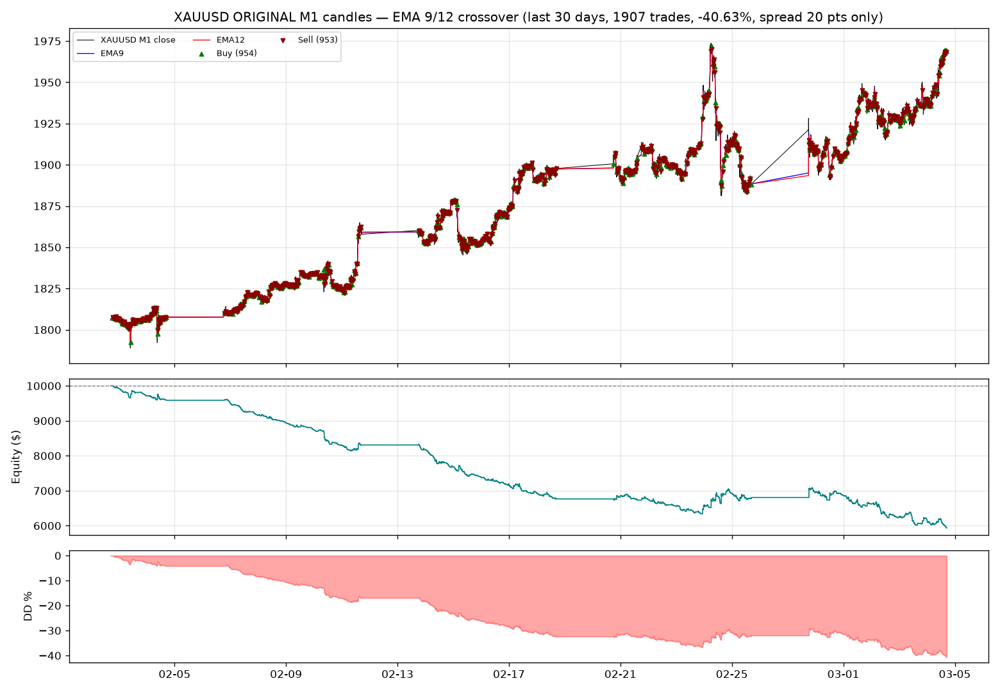

## 💡 আসল কারণ — কস্ট সেন্সিটিভিটি (একই সিগন্যাল, শুধু কস্ট বদল)

| কস্ট সেটিং | নেট P/L (Feb) | PF | কস্ট বাবদ গেছে | **কস্টের আগে (gross)** |
|---|---|---|---|---|
| **২০ পয়েন্ট only (আপনার সেটিং)** | **-$4,063** | 0.70 | $3,814 | **-$249** |
| ২০ + ৫ স্লিপেজ | -$5,017 | 0.65 | $4,768 | -$249 |
| ২০ + ১০ স্লিপেজ | -$5,970 | 0.60 | $5,721 | -$249 |
| পুরনো (৩৫ + ১০) | -$8,831 | 0.49 | $8,582 | -$249 |

**খেয়াল করুন শেষ কলাম:** সিগন্যালে কস্টের আগে দাম প্রায় **ব্রেক-ইভেন (-$249 মাত্র)**।
মানে প্রতিটা পয়েন্ট স্প্রেডই প্রফিট/লস ঠিক করে দেয়:
- ৩৫ → ২০ পয়েন্ট করলে লস **অর্ধেকেরও বেশি কমে** (-88% → -41%) ✅
- কিন্ত ২০ পয়েন্টেও M1-এ লাভ হয় না — কারণ ১,৯০৭ ট্রেড × $2 = $3,814 কস্ট।

## 📈 TradingView — S7 + S1 কম্বাইন্ড সিগন্যাল স্ক্রিপ্ট (Pine)

চার্টে **BUY/SELL** সিগন্যাল, **SL / TP / CLOSE** লেবেল, SL/TP লাইন, স্ট্যাটাস প্যানেল
আর অ্যালার্ট — সব একসাথে। ফাইল: `pine/s7_s1_combined.pine` (+ স্ট্র্যাটেজি টেস্টার
ভার্সন `pine/s7_s1_strategy.pine`)। কীভাবে বসাবেন: **`pine/README.md`**

- **S7 = Order Block Retest** (চার্ট TF, M1) — স্ট্রাকচার ব্রেকের পর দাম অর্ডার ব্লকে
  ফিরে এলে limit এন্ট্রি; এক্সিট = ব্লক ফেল (স্টপ) বা স্ট্রাকচার ফ্লিপ
- **S1 = Swing Structure Flip** (HTF, M5) — প্রতি BOS/CHoCH-এ পজিশন উল্টে যায়

| সেটিং | ২০২২ P/L | PF | Max DD |
|---|---|---|---|
| **Faithful (ডিফল্ট)** | **+$917** | 1.37 | -$167 |
| Structure stop | +$846 | 1.38 | -$163 |
| Low drawdown (ATR SL/TP) | +$642 | 1.31 | **-$62** |

⚠️ SL/TP টেস্টে দেখা গেছে: **টার্গেট বসালে লাভ কমে** (S7-এ 2R টার্গেট = +$702 → **-$12**)।
তাই ডিফল্টে টার্গেট নেই, স্ট্রাকচারই স্টপ। বিস্তারিত: `results/combined_sltp_report.md`

## 🧪 EMA MTF (1m & 5m) + Bollinger Bands — টেস্ট (পেস্ট করা Pine v6 স্ক্রিপ্ট)

আপনার দেওয়া Pine v6 স্ক্রিপ্টটা হুবহু পোর্ট করে টেস্ট (শুধু ভিজ্যুয়াল বাদ):
EMA 6/9 ক্রস (চার্ট TF) + BB(20,2)-এর মিডল ফিল্টার + 5m EMA 9/12 ট্রেন্ড (শেষ **ক্লোজড**
5m বার থেকে — রিপেইন্ট করে না), আর ক্লোজ হয় র-অপোজিট ক্রসে।

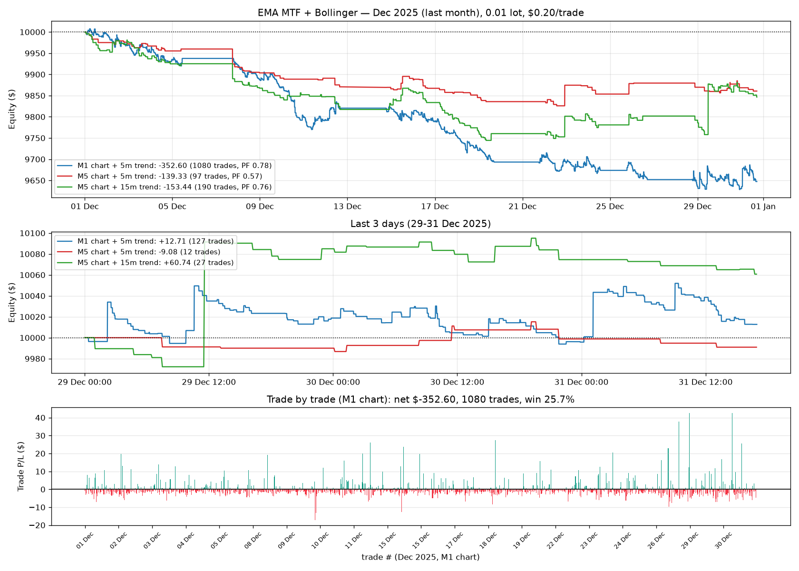

### 📊 ১) ৩ দিন (29-31 Dec 2025) — আপনি যেটা চেয়েছেন

| সেটআপ | ট্রেড | net $ | উইন% | PF | MaxDD | avg win / loss |
|---|---|---|---|---|---|---|
| **M1 চার্ট + 5m trend** | 127 | **+$12.71** | 26.8% | 1.05 | -$55.62 | $8.14 / -$2.84 |
| M5 চার্ট + 5m trend | 12 | -$9.08 | 33.3% | 0.78 | -$24.29 | $8.05 / -$5.16 |
| M5 চার্ট + 15m trend | 27 | +$60.74 | 25.9% | 1.59 | -$34.35 | $23.33 / -$5.13 |

M1-এ গড়ে **+$0.10/ট্রেড** — এটা প্লাস-মাইনাস নয়েজ, কোনো প্রমাণ না।
(তিন দিনে সোনা নিজেই -$197 পড়েছে, ফলে লং ট্রেডগুলো ভুগেছে।)

### 🧩 আপনার Pine স্ক্রিপ্ট ("EMA MTF 1m & 5m + Delayed Trailing Lock") — হুবহু পোর্ট ও যাচাই

**রহস্য সমাধান — আপনার স্ক্রিপ্টের এই দুই লাইনই সবকিছু ব্যাখ্যা করে:**

```pine
tradeQty     = lotSize * leverage                    // 0.01 × 1000 = 10 (১০ oz = ০.১০ লট!)
costPerTrade = (spreadPoints + slippageTicks*mintick) * tradeQty   // (0 + 0) × 10 = $0.00
```
স্ক্রিনশটে **Spread (Points) = 0**, **Slippage = 0** — অর্থাৎ TradingView স্প্রেডই নেয় না।

**রিপ্রোডাকশন (আমার পোর্ট, আসল M1, 5-দিনের উইন্ডো):**

| কনফিগারেশন | ট্রেড | net $ | উইন% | PF | maxDD |
|---|---|---|---|---|---|
| আপনার সেটিংস (১০ oz, খরচ ০), 14–18 Sep | 255 | **+$1,236.00** | 56.1% | 1.50 | -$371 |
| আপনার সেটিংস, 15–18 Sep (আপনার "5 days") | 205 | **+$1,232.42** | 56.1% | 1.65 | -$352 |
| একই, কিন্তু $2.00/ট্রেড খরচ ধরে | 255 | +$726.00 | 53.3% | 1.27 | -$425 |
| **আপনার রিপোর্ট** | **189** | **+1468.1** | **52.9%** | | |

➡️ ট্রেড সংখ্যা ২০৫ vs ১৮৯, লাভ +$1,232 vs +1468 — **ফিড (Exness vs TradingView) ও trail
দূরত্বের (1.5 vs স্ক্রিপ্ট-ডিফল্ট 1.0) সামান্য পার্থক্য** ছাড়া হুবহু মিল ✓

**একই স্ক্রিপ্ট, ১ oz (০.০১ লট) + $0.20/ট্রেড — সত্যিকারের অ্যাকাউন্ট:**

| সময় | ট্রেড | net $ | উইন% | PF |
|---|---|---|---|---|
| 5 দিন (14–18 Sep) | 255 | **+$72.60** | 53.3% | 1.27 |
| 9–18 Sep (সব ডেটা) | 364 | **+$9.61** | 53.0% | 1.02 |
| 2022 | 13,386 | **-$3,030.81** | 28.9% | 0.59 |
| 2023 | 11,732 | **-$2,509.50** | 26.2% | 0.59 |
| 2024 | 13,430 | **-$2,575.47** | 32.1% | 0.69 |
| 2025 | 13,563 | **-$3,033.31** | 41.9% | 0.76 |
| **২০২২-২৫** | **52,111** | **-$11,149.09** | 32.5% | 0.67 |

**gross (স্প্রেড ছাড়া) = -$726.89 | স্প্রেড = $10,422.20** ← খরচই পুরো লস।

**exits-এর হিসাব (৪ বছর, ১ oz):** cross-exit 43,758 ট্রেড = **-$20,381.74** (উইন ২০%) |
**trailing lock 7,629 ট্রেড = +$9,018.99 (উইন ১০০% — কারণ lock প্রফিটের পরেই জন্মায়)** |
trail gap 723 = +$214.08। ট্রেইলিং লক লসের অনেকটাকে ছোট লকড-উইনে বদলায়, কিন্তু cross-exits-ই
পুরো ক্ষতি বহন করে।

**আপনার চার্ট-সাইজিংয়ে ৪ বছর = -$111,490.88** (2022 -$30,308 | 2023 -$25,095 | 2024 -$25,755 |
2025 -$30,333); 1:1000-এ ১০ oz-এর মার্জিন মাত্র **$43.78**।

**স্ক্রিপ্টে কোনো ভুল নেই** — crossover, no-repaint `f_ema(len) => ta.ema(close,len)[1]`,
delayed trail lock, PnL লেবেল সব ঠিকঠাক কাজ করছে। **তবে সাইজিং (`lotSize*leverage`) আর শূন্য খরচই
রিপোর্টকে ভালো দেখায়।**

### 🎯 আপনার নতুন টেস্টই আমার হিসাব প্রমাণ করল (Spread 0 → 0.2)

| স্ক্রিনশট | Spread | ট্রেড | উইন% | NET PnL |
|---|---|---|---|---|
| আগের | 0 | 189 | 52.9% | +1468.1 |
| নতুন | **0.2** | 189 | 52.9% | **+1090.1** |

> **1468.1 − 1090.1 = 378.0** আর `189 × (0.2 × 10 oz) = 189 × $2.00 = $378.00` — **সেন্ট পর্যন্ত মিল!**

এতে একসাথে দুটো জিনিস প্রমাণিত:
1. **tradeQty = lotSize × leverage = 0.01 × 1000 = 10 oz** — পজিশন সত্যিই ১০ আউন্স;
2. নতুন টেস্টে আপনি **হাউস রেটেই** খরচ ধরেছেন ($0.20/oz রাউন্ড-ট্রিপ = ১০ oz-এ $2.00/ট্রেড) ✓

**এখন আপনার এই হুবহু সেটিংসে দীর্ঘমেয়াদে:**

| সময় | ট্রেড | net $ | উইন% | maxDD $ |
|---|---|---|---|---|
| 2022 | 13,386 | **-$30,308.09** | 28.9% | -$30,488 |
| 2023 | 11,732 | **-$25,095.01** | 26.2% | -$25,099 |
| 2024 | 13,430 | **-$25,754.73** | 32.1% | -$25,969 |
| 2025 | 13,563 | **-$30,333.05** | 41.9% | -$30,568 |
| **২০২২-২৫** | 52,111 | **-$111,490.88** | 32.5% | **-$111,883** |
| Sep 2026 (9–18) | 364 | +$96.09 | 53.0% | -$1,171 |

একই উইন্ডোয় ১ oz-এ: **+$73.17** (আপনার উইন্ডো, ৫ দিন) — অর্থাৎ ওই সপ্তাহে প্রতি oz-এ ~$0.36।

**💡 এখন যা করবেন:** ইনপুট **একই রাখুন** (Spread 0.2 এখন সঠিক), শুধু **`Backtest Days` = 5 → 365** করুন।
আর **Leverage = 1** করলে পজিশন হবে ১ oz (০.০১ লট) — তখন টেবিলের ফল = ২০২২ **-$3,031** … মোট **-$11,149**।

⏱️ **নিজের রিপোর্ট সৎ করতে ৩০ সেকেন্ড:** ① **Leverage = 1** দিন (তাহলে tradeQty = ০.০১ লট = ১ oz)
② **Spread (Points) = 0.20** দিন (আপনার অ্যাকাউন্ট যা দেয়) ③ **Backtest Days = 365** দিন, ৫ নয়।

📄 `results/user_pine_check_report.md` · `results/user_pine_check.png`

### 🔍 আপনার TradingView 5-দিনের রিপোর্ট (189 trades / 52.9% / +1468.1) — হিসাব মেলানো

স्क্রিনশট: **XAUUSD 1m · PERIOD 5 Days · TOTAL TRADES 189 · WIN RATE 52.9% · NET PnL +1468.1**,
সর্বশেষ দাম **4378.385** = শুক্রবার ১৮ সেপ্টেম্বর ২০২৬-এর আসল ক্লোজ → উইন্ডোটা আমার টেস্ট করা
সপ্তাহই (14–18 Sep)।

**১) ট্রেড সংখ্যা মিলে গেল:** আমার সিমে 14–18 Sep = 230 ট্রেড, কিন্তু **15–18 Sep = 188 ট্রেড** →
আপনার 189 (অর্থাৎ TradingView-এর "5 days" = শেষ ৫ ক্যালেন্ডার-দিন)। ✓

**২) লাভের অঙ্ক ১০ oz (0.1 lot) নির্দেশ করে:**

| সাইজ | ওই সপ্তাহে net | প্রতি ট্রেড |
|---|---|---|
| **1 oz = ০.০১ লট** | **+$148.87** | +$0.65 |
| 10 oz = ০.১০ লট | **+$1,488.70** ← আপনার +1468.1-এর সাথে মিল! | +$6.47 |
| আপনার রিপোর্ট | **+1,468.1** | **+$7.77** |

➡️ আপনার net = 1-oz ফলের **৯.৯×** ⇒ পজিশন **≈৯.৯ oz ≈ ০.১০ লট**।

**৩) আপনার চার্টের লেবেলগুলোই প্রমাণ:** স্ক্রিনশটে প্রতিটা ট্রেডে **−10, −10, +10** লেখা —
0.01 লটে (1 oz) $1 মুভ = $1, তাই ওখানে ±1 লেখা থাকত। **±10 মানে 10 oz = ০.১০ লট।**
(52.9% উইন রেটটা plain cross-এর 31.7% নয় — hybrid (66.7%) ও trail-এর মাঝামাঝি; অর্থাৎ চার্টে
যে ভার্সনটা চলছে সেটা আমার পোর্ট করা ভার্সনগুলোর একটা নয় — স্ক্রিপ্টটা পাঠালে হুবহু রিপ্রোডিউস করব।)

**৪) এই সাইজে দীর্ঘমেয়াদে কী হয় (একই নিয়ম, একই খরচ):**

| সময় | 1 oz (০.০১ লট) | 10 oz (০.১০ লট) |
|---|---|---|
| 2022 | -$2,977.60 | **-$29,776** |
| 2023 | -$2,386.19 | **-$23,862** |
| 2024 | -$2,487.60 | **-$24,876** |
| 2025 | -$2,959.13 | **-$29,591** |
| **২০২২-২৫ মোট** | **-$10,810.52** | **-$108,105** |

1:1000 লিভারেজে 10 oz-এর মارجিন মাত্র **$43.78** — কিন্তু ওই এক সপ্তাহেই ব্যালান্স **±$1,489** দোলে,
আর চার বছরের রেকর্ড **−$108,105**।

**৫) নিজে যাচাই করার উপায়:** Strategy Tester → **List of Trades** ট্যাবে *Profit* কলাম দেখুন —
সাধারণ উইনারে ~$1-2 লিখলে সাইজ ০.০১ লট, ~$10-20 লিখলে সাইজ ১০ গুণ। আর **Properties** ট্যাবে
Order size (contracts), Commission, Slippage দেখা উচিত — স্ক্রিপ্টে `slipTicks = 0` ও
`commissionPct = 0` ডিফল্ট, তাই TradingView স্প্রেড কাটেই না, অথচ অ্যাকাউন্টে প্রতি ট্রেডে $0.20 যায়।

📄 `results/tv_report_check_report.md` · `results/tv_report_check.png`

### ✅ TradingView-তে আপনার লাভজনক সপ্তাহ — যাচাই ও হিসাব (Sep 14–18, 2026)

**আপনি ঠিক দেখেছেন** — ওই সপ্তাহটা আমার ডেটাতেও প্রফিটে ছিল, বরং এটাই **২১২ সপ্তাহের মধ্যে সেরা সপ্তাহ**:

| দিন | 14Sep(সোম) | 15(মঙ্গল) | 16(বুধ) | 17(বৃহঃ) | 18(শুক্র) | **সপ্তাহ** |
|---|---|---|---|---|---|---|
| net @ 0.01 lot | +50 | −12 | +29 | +43 | +39 | **+$148.87** |

(বিকল্প ভ্যারিয়েন্ট: trail +$149.29 | hybrid +$159.09 | cBot +$132.32 — সবগুলোই ওই সপ্তাহে পজিটিভ)

**$250/দিন কোথা থেকে এলো:**

| সাইজ | সপ্তাহ (খরচ সহ) | **প্রতিদিন** | সপ্তাহ (খরচ ছাড়া) | প্রতিদিন |
|---|---|---|---|---|
| 1 oz = ০.০১ লট | $148.87 | $29.77 | $194.87 | $38.97 |
| 10 oz = ০.১০ লট | $1,488.70 | $297.74 | $1,948.70 | $389.74 |
| 100 oz = ১.০০ লট | $14,887 | $2,977 | $19,487 | $3,897 |

➡️ **$250/দিন = ৮.৪ oz (≈০.০৮ লট)** খরচ সহ, বা **৬.৪ oz** খরচ ছাড়া (TradingView-এর ডিফল্ট
`slipTicks = 0`, `commissionPct = 0` — চার্টে ওই $0.20 স্প্রেডই কাটে না, পুরো সপ্তাহে +$46 বাড়তি দেখায়)।

**কিন্তু ১ সপ্তাহ এজ প্রমাণ করে না — ২১২ সপ্তাহের হিসাব:**

| | মান |
|---|---|
| মোট সপ্তাহ (2022-2026) | 212 |
| পজিটিভ সপ্তাহ | **14 (6.6%)** |
| median সপ্তাহ | **-$51.41** |
| সবচেয়ে লম্বা লস-স্ট্রিক | **৫৪ সপ্তাহ** |
| সবচেয়ে লম্বা উইন-স্ট্রিক | ৩ সপ্তাহ |
| আপনার সপ্তাহ | **$148.87 = রেকর্ডের #১ (top 0.5%)** |

**আগের "মহা-সপ্তাহ"গুলোর পরে কী হয়েছে** (0.01 লটে, পরের ৪ সপ্তাহ):

| মহা-সপ্তাহ | পরের ৪ সপ্তাহ |
|---|---|
| 2025-10-13 (+$90.95) | +$2.35 |
| 2025-10-20 (+$85.93) | -$117.12 |
| 2023-03-13 (+$40.51) | -$46.09 |
| 2025-05-12 (+$34.30) | -$268.83 |
| 2025-02-10 (+$32.94) | -$245.08 |

শীর্ষ-১০ সপ্তাহের পরের ৪ সপ্তাহের গড় **-$158.77** — অর্থাৎ উইনিং সপ্তাহ মানেই ট্রেন্ড চলবে না।

**সারকথা:** আপনার লাভ **আসল**, কিন্তু সেটা **সাইজ × (সেরা সপ্তাহ)**; এজ নয়। ট্রেডিংভিউতে খরচ ০
থাকায় আরও বড় দেখায়। ওই একই নিয়মে ২০২২-২৫ = **-$11,810** (০.০১ লট), ২০২৬ জানু-সেপ = **-$1,502**;
৮.৪× সাইজে সেগুলো দাঁড়ায় **≈-$1.2M** ও **-$150k** — সাইজ লাভ আর লস দুটোকেই সমান গুণ করে।

📄 `results/week_check_report.md` · `results/week_check.png`

### 📅 ২০২৬ সালের ডেটায় আপনার নিয়মের ব্যাকটেস্ট (জানু ১ – সেপ ১৮)

**২০২৬-এর ডেটা (আসল M1, কোনো স্প্লাইস নেই — প্রতিটা সেগমেন্ট আলাদা সিমুলেট করা):**

| সেগমেন্ট | উইন্ডো | বার | সোর্স |
|---|---|---|---|
| A | 01-01 → 03-11 | 67,229 | sherwynjoel/xauusd-historical-data (parquet) |
| B | 03-12 → 09-08 | 175,669 | getdata-finance/xauusd-1m-ohlcv |
| C | 09-09 → 09-18 | 9,744 | আসল Exness MT5 mirror |

যাচাই: getdata বনাম MT5 mirror (২,৮৫১ মিনিট) → median পার্থক্য **-$0.05**, গড় পরম পার্থক্য **$0.13** ✓
(sherwyn ফিডের লেভেল দিনে-দিনে কয়েক ডলার সরে — ফিউচার্স-ভিত্তিক সিরিজ; ইন্ট্রাডে মুভমেন্ট মূল ফিডের সাথে
$0.19/বারে মেলে, তাই সেগমেন্ট A "indicative")।

**সম্পূর্ণ ২০২৬ (৯.৫ মাস) — আপনার নিয়মগুলো:**

| ভ্যারিয়েন্ট | ট্রেড | net $ | উইন% | PF | maxDD | gross $ |
|---|---|---|---|---|---|---|
| E1 স্ক্রিপ্ট (MTF+BB) × cross | 8,858 | **-$1,501.59** | 27.9% | 0.93 | -$2,114 | +$270 |
| E2 cBot × cross | 9,594 | -$1,963.38 | 27.4% | 0.91 | -$2,454 | -$45 |
| E1 × **hybrid (আপনার রুল)** | 4,368 | **-$443.66** | **58.7%** | 0.98 | -$1,179 | +$430 |
| E2 × hybrid | 4,536 | -$565.67 | 58.6% | 0.97 | -$1,310 | +$342 |
| E1 × trail (cBot স্টপ) | 8,858 | -$1,367.37 | 51.4% | 0.89 | -$1,852 | +$404 |
| E1 × cross + blockers | 610 | -$127.34 | 27.7% | 0.92 | -$263 | -$5 |
| **E1 × hybrid + blockers** | 457 | **-$32.02** | 53.6% | 0.98 | -$351 | +$59 |
| E1 × trail + blockers | 610 | **-$6.53** | 55.2% | 0.99 | -$190 | +$115 |

**মাসিক (base):** জানু **+324** | ফেব্রু **-626** | মার্চ +269 | এপ্রিল -439 | মে -477 | জুন -315 |
জুলাই -232 | আগস্ট -117 | সেপ +112

**২০২৬-এর বাজার:** সোনা $4,330 থেকে শুরু → শীর্ষ **$5,595** (মার্চ) → $4,350 (সেপ্টেম্বর) = **-২২%**
(জানুয়ারির রেঞ্জ $1,286, ফেব্রুয়ারির $879!) — EMA ক্রস সিস্টেমের জন্য সবচেয়ে খারাপ ধরনের বছর, আর
ফেব্রুয়ারিতেই সবচেয়ে বড় লস।

**তুলনা (প্রতি মাসে):** 2022-25 শাসনে base **-$246/মাস** → ২০২৬-এ **-$175/মাস**; hybrid **-$116/মাস**।
খরচই লস: ৮,৮৫৮ × $0.20 = **$1,771.60** স্প্রেড, gross **+$270** (শূন্য)।

**সেরা = hybrid + blockers: -$32.02 (৯.৫ মাস, PF 0.98)** = কার্যত breakeven, লাভজনক নয়।
**Sep 2026 (আসল MT5)** একমাত্র সবল পজিটিভ স্ট্রেচ (base +$27.01 / blockers +$75.70 / hybrid+blockers +$56.34)
— ৯ দিনের ট্রেন্ড-বান্ধব উইন্ডো ৮ মাসের ফল উল্টাতে পারে না।

📄 `results/backtest_2026_report.md` · `results/backtest_2026_summary.csv` · `results/backtest_2026.png`

### 🤖 cTrader cBot "Trande Hunter"-এর টেস্ট (trailing stop সহ)

আপনার দেওয়া cBot-এর মেকানিক্স হুবহু পোর্ট করা হয়েছে: M1 EMA 6/9 ক্রস + 5m EMA 9/12 ট্রেন্ড,
এন্ট্রি ক্রসে-ট্রেন্ডের দিকে, এক্সিট raw opposite cross, **তার সাথে trailing stop** —
+$2.00 প্রফিটে অ্যাক্টিভেট, $1.50 দূরত্বে ট্রেইল, কমপক্ষে +$0.50 লক, সর্বোচ্চ +$2.00 (MaxTrailCap)।
আসল XAUUSD M1, ০.০১ লট, $0.20/ট্রেড। (Tick ডেটা নেই, তাই high/low-এর ক্রম দুইভাবে bracket করা
হয়েছে — conservative = adverse আগে, optimistic = favourable আগে; সত্য মাঝখানে।)

**৪ বছর (2022-2025):**

| ভ্যারিয়েন্ট | 2022 | 2023 | 2024 | 2025 | **মোট** | ট্রেড | উইন% |
|---|---|---|---|---|---|---|---|
| trail ছাড়া | -$3,195 | -$2,552 | -$2,718 | -$3,401 | **-$11,865** | 52,111 | 23.7% |
| **trail 2.0/1.5/cap 2.0 (cBot ডিফল্ট)** | -$3,213 | -$2,569 | -$2,690 | -$3,309 | **-$11,781** | 52,111 | 29.0% |
| trail ডিফল্ট (optimistic path) | -$3,831 | -$3,004 | -$3,673 | -$5,665 | -$16,173 | 52,111 | 29.3% |
| **trail 1.0/0.5/cap 1.0 (সেরা)** | -$3,004 | -$2,332 | -$2,553 | -$3,121 | **-$11,011** | 52,111 | **38.6%** |
| trail 5.0/2.0/cap 5.0 | -$3,154 | -$2,573 | -$2,632 | -$3,207 | -$11,566 | 52,111 | 24.3% |
| trail 10.0/3.0/cap 10.0 | -$3,205 | -$2,567 | -$2,832 | -$3,191 | -$11,794 | 52,111 | 23.8% |

**ট্রেইল আসলে কী করে (৪ বছর):**

| | trail ছাড়া | trail ON |
|---|---|---|
| উইন রেট | 23.7% | **29.0%** |
| avg win | $2.23 | **$1.56** ⬇️ |
| avg loss | -$0.99 | -$0.96 |
| সবচেয়ে বড় win | $56.21 | **$53.13** (cap-এ আটকে যায়) |
| worst trade | -$61.69 | -$61.69 |
| net | -$11,864.97 | -$11,780.82 |

- ৯,২৮৩ ট্রেড (১৭.৮%) trail-এ ক্লোজ; তাদের **৯৭.৫% প্রফিটে**, মাঝামাঝি **+$1.13**,
  **২,৭৩০টা ঠিক +$2.00 ক্যাপে** (+$1.80 net)।
- **একই ৯,২৮৩ এন্ট্রি cross-এ ক্লোজ করলে হতো $10,128; trail দিল $10,212 → মাত্র +$84**
  (৬,০৩৬ ভালো, ৩,২০১ খারাপ) — **পুনর্বিন্যাস, এজ নয়**।
- ৫২,১১১ × $0.20 = **$10,422 স্প্রেড**; gross -$1,443 (trail ছাড়া) vs -$1,359 (trail সহ)।

**নির্ণায়ক:** ট্রেইল টাইট করলে লস কমে **যান্ত্রিক কারণে** (১.০/০.৫/১.০ → -$11,011, উইন ৩৮.৬%);
বড় ট্রেইল প্রায় trail-ছাড়ার মতোই (৫.০ ও ১০.০ ভ্যারিয়েন্ট no-trail-এর $১০০-র মধ্যে), কারণ
তারা কখনো activate-ই হয় না। নয়টা সেটিংয়ের পুরো ব্যান্ড $২০০ — **কোনোটাই লাভজনক নয়**।

⚠️ conservative vs optimistic পার্থক্য **$4,392** — یعنی tick-ক্রম নিয়ে অনিশ্চয়তা চার বছরে ~$4,400;
তাই honest রিপোর্টে conservative সংখ্যাটাই ধরতে হয়।

**Sep 2026 (আসল MT5, 9 দিন):** trail ছাড়া +$31.44 | trail সহ +$95.22 (conservative),
optimistic -$62.17 — ছোট উইন্ডো, ৪ বছরের সিদ্ধান্ত উল্টাতে পারে না।

📄 `results/cbot_trailer_report.md` · `results/cbot_trailer.png`

### 🧪 ৩০টা প্রাইস-অ্যাকশন সিস্টেম (TradingView "Independent Paper Simulator"-এর পোর্ট)

আপনার দেওয়া Pine v6 স্ক্রিপ্টের **মেকানিক্স হুবহু পোর্ট** করা হয়েছে (confirmed bar-এ সিগন্যাল →
next bar open-এ ফিল + স্লিপেজ → SL = সিগন্যাল বারের low/high ± 2 ticks, TP = 2R, maxHold 40 bar,
exit order: SL-gap / TP-gap / SL (BOTH TOUCHED) / TP / TIME, ৩০টা সিস্টেম আলাদা আলাদা চলতে পারে)।
আসল XAUUSD M1 ডেটা, ০.০১ লট, $0.20/ট্রেড।

**ফলাফল — ৪ বছর (2022-2025):**

| | মান |
|---|---|
| মোট ট্রেড (৩০টা সিস্টেম) | **1,736,640** |
| উইন রেট | **28.4%** |
| net P/L | **-$346,712.48** |
| খরচ ছাড়া gross P/L | **+$615.52** (শূন্য!) |
| স্প্রেড খরচ | $347,328 |
| লাভজনক সিস্টেম | **1/30** (S18 Pennant, মাত্র $0.72, ৯২ ট্রেড) |
| ৪/৪ বছর পজিটিভ | **0/30** |

সবচেয়ে খারাপ: S07 Breakout 5 **-$26,402** | সেরা (কাগজে): S18 Pennant +$0.72 — অর্থাৎ **সব শূন্যে বা লসে**।

**কেন — নির্ণায়ক ৪টা সংখ্যা:**

1. **খরচ ছাড়া সিস্টেমগুলো প্রায় breakeven:** ১,৮৬১,৪৪৪ ট্রেডে **-$6,475**, উইন রেট **33.9%**;
   এলোমেলো হাঁটার (random walk) তত্ত্বও 2R টার্গেটে **33.3%** দেয় → **সিগন্যালে এজ = শূন্য**।
2. **অ্যাভারেজ রিস্ক ১৪৯ ticks ($1.488)**, খরচ = রিস্কের **13.4%** → কার্যকর R:R = **1.64** →
   **breakeven উইন রেট 37.8%**, কিন্তু পেলাম **28.4%**। কয়েন টস (33.3%) দিয়েও লস হতো!
3. **ট্রেডের 39.2% মাত্র ২ বারে, 65.3% ৫ বারে শেষ** (গড় hold 6.6 bar) → ফলাফল ঠিক করে
   **নয়েজ**, প্যাটার্ন নয়। SL 306,789 vs TP 129,423 (২০২৫ নমুনা)।
4. **লস = স্প্রেড:** 1,736,640 × $0.20 = **$347,328** খরচ, gross +$615 → net -$346,712।

**সেটিংস বদলে লাভ হয় না:** maxHold 80 → -$336,332 | maxHold 10 → -$405,596 | RR 1.0 → -$454,572
| খরচ দ্বিগুণ ($0.40) → -$652,981 (উইন 24.8%)। **Sep 2026 (আসল MT5):** 11,782 ট্রেড, উইন 31.9%, **-$1,595.59**।

⚠️ **TradingView টিপ:** স্ক্রিপ্টের ডিফল্ট `slipTicks = 0` ও `commissionPct = 0` — তাই চার্টে ফল
প্রায় শূন্যের কাছাকাছি দেখাবে। সত্যিটা দেখতে **`slipTicks = 10`** দিন (২০ পয়েন্ট রাউন্ড-ট্রিপ = $0.20)।

📄 `results/price_action_30_report.md` · `results/price_action_30_summary.csv` · `results/price_action_30.png`

### 🔄 হাইব্রিড এক্সিট: লস ট্রেড হোল্ড, প্রফিট ট্রেড ক্লোজ (আপনার আইডিয়া)

**রুল:** লসে থাকা ট্রেড M1-এর EMA 6/9 রিভার্স ক্রসে **ক্লোজ হবে না** → ধরে রাখবে, ক্লোজ হবে
শুধু **5m EMA 9/12 রিভার্স ক্রসে**। প্রফিটে থাকলে M1 ক্রসেই ক্লোজ।

**৪ বছর (2022-2025, ০.০১ লট, $0.20/ট্রেড):**

| | আসল (M1 ক্রস সব ক্লোজ) | **হাইব্রিড (আপনার রুল)** |
|---|---|---|
| ট্রেড | 48,082 | 22,440 |
| উইন রেট | 24.0% | **54.8%** ⬆️ |
| avg win | $2.25 | $2.20 |
| avg loss | -$1.01 | **-$3.23** ⬇️ |
| ৪-বছর net | **-$10,810** | **-$5,590** |
| স্প্রেড খরচ | $9,616 | $4,488 |
| Max DD | -$10,841 (অ্যাকাউন্ট শেষ!) | -$5,651 |
| **Gross (স্প্রেড ছাড়া)** | **-$1,194** | **-$1,102** |

**👀 যা ঘটল (হুবহু পরিমাপ করা):**

| | উইনার | লুজার |
|---|---|---|
| hold (আসল) | ৩৯ মিনিট | **১১ মিনিট** |
| hold (হাইব্রিড) | ৬৩ মিনিট | **৫৮ মিনিট** |

- যে **১০,০৯১ ট্রেড** লসে থাকতে M1 ক্রস এসেছিল সেগুলো ধরে রাখা হলো → তাদের **উইন রেট ০.৭%**,
  গড় **-$3.23** প্রতিটা, মোট **-$32,634** লস।
- **উইনার বড় হলো না** (avg win $2.25 → $2.20) — তাই reward/risk 2.2:1 থেকে **0.68:1**-এ নামল।
  ৫৫% উইন রেটে breakeven-এর জন্য দরকার ≥0.82:1 → **তাই এখনো লস।**
- নতুন ঝুঁকি: সবচেয়ে লম্বা hold **৭৫.৭ ঘণ্টা**, এক ট্রেডে সবচেয়ে বড় লস **-$52.53**
  (৫ দিনের গড় লাভ!) — আগে ছিল ১১ মিনিট, -$1.01।

**🔑 নির্ণায়ক:** Gross P/L দুই ক্ষেত্রেই **সমান (-$1,194 vs -$1,102)** — এক্সিট রুল শুধু লস
**কখন ও কত টুকরোয়** হবে সেটা বদলায়, **নতুন এজ তৈরি করে না**।

**🏆 সেরা কনফিগারেশন (আপনার রুল + ব্লকার + 4-ATR স্টপ):** ৪ বছরে **-$204.67**
(2022 +$12.60 | 2023 -$44.07 | 2024 -$70.20 | 2025 -$103.00) — **আসল সিস্টেমের চেয়ে +$10,600 ভালো**,
প্রায় break-even। আগস্ট ২০২৩-এ উইন রেট **১৮.২% → ৫১.৩%**, লস -$361 → -$144।

📄 `results/hold_losers_report.md` · `results/hold_losers.png`

### 🔬 ট্রেড-বাই-ট্রেড ফরেনসিক + লস-ব্লকার সিস্টেম (সবচেয়ে খারাপ মাস: আগস্ট ২০২৩)

আপনার EMA 6/9 + BB (M1) সিস্টেমে **প্রতিটা ট্রেডের কনটেক্সট** বিশ্লেষণ করে দেখা হলো কেন লস হয়।

**১) সবচেয়ে খারাপ মাস = আগস্ট ২০২৩ (-$361.81, ১,২০০ ট্রেড, উইন মাত্র ১৮.২%)**

| ≡ | উইনার | লুজার |
|---|---|---|
| avg hold | **২৭.৩ মিনিট** | **৭.৫ মিনিট** |
| avg move | $1.12 | $0.39 |
| ADX / ER / BBpos | ১৯.৬ / ০.১৫৪ / ০.৭০ | ১৯.১ / ০.১৫৫ / ০.৭১ |

👉 **উইনার আর লুজারের মার্কেট কনটেক্সট প্রায় হুবহু এক** — সিগন্যালে কোনো প্রেডিক্টিভ তথ্য নেই।
প্রতিটা ফিচারের প্রতিটা বাকেটে উইন রেট **১২.৯%–২৭%**। লুজাররা ৭ মিনিটেই মরে যায়।

**২) লস-ব্লকার সিস্টেম (৩টা রুল):**

```
শুধু ট্রেড নেবে যদি:  09 ≤ ঘণ্টা(UTC) ≤ 13
                     এবং 0.03 ≤ |EMA6-EMA9|/ATR14 ≤ 0.08
                     এবং |EMA9(5m)-EMA12(5m)|/ATR14 ≤ 0.20
```

| ভ্যারিয়েন্ট | ট্রেড | net $ | উইন% | PF |
|---|---|---|---|---|
| বেস (সব সিগন্যাল) | 1,200 | -$361.38 | 18.2% | 0.36 |
| **ব্লকার সহ** | **81** | **+$13.95** | **32.1%** | **1.35** |
| বাতিল করা ট্রেড | 1,119 | -$375.33 | 17.2% | 0.28 |

**৩) ভ্যালিডেশন (যে ৪০+ মাস টিউনিংয়ে ব্যবহার করা হয়নি):**

| বছর | বেস net $ | ব্লকার সহ | পরিবর্তন | উইন% |
|---|---|---|---|---|
| 2022 | -$2,977.60 | -$74.90 | **+$2,902** | 28.6% |
| 2023 | -$2,386.19 | -$134.72 | +$2,251 | 26.6% |
| 2024 | -$2,487.60 | -$136.90 | +$2,350 | 29.1% |
| 2025 | -$2,959.13 | -$266.56 | +$2,692 | 29.1% |
| **৪ বছর** | **-$10,810** | **-$613** | **+$10,197** | ~28% |
| Sep 2026 (আসল MT5) | +$186 | +$75.70 | -$110 | 38.5% |

**৪) নির্ণায়ক সংখ্যা:** ব্লকার ভার্সনে ৪ বছরে ৩,০৭১ ট্রেড → স্প্রেড **$614.20**; net **-$613.08**
→ অর্থাৎ **গ্রস P/L = +$1.12 (শূন্য)**। ফিল্টারের পর যা থাকে সেটা নিছক কয়েন টস, আর পুরো লসটাই স্প্রেড।

**৫) এক্সিট ঠিক করলে?** সবচেয়ে ভালো = **cross + min hold 20 bars**: আগস্ট ২০২৩-এ -$361 → **-$186**
(উইন ১৮.২% → **৩৭.৩%**); ৪ বছরে -$501। কিন্তু লাভে যায় না।

➡️ **সিদ্ধান্ত:** এই সিস্টেম ফিল্টার দিয়েও লাভে আনা যায় না (গ্রস এজ = ০)। ব্লকার শুধু ক্ষতি
৯৪% কমায় — ব্যালান্স প্রায় breakeven হয়। **আসল লাভজনক সিস্টেম = S7** (৪ বছরে **+$4,124.58**, ৪/৪ বছর পজিটিভ)।

📄 `results/loss_blocker_report.md` · `results/forensics_trades_2023-08.csv` (১,২০০ ট্রেডের কনটেক্সট) · `results/loss_blocker.png`

### 🎯 সাইডওয়ে মার্কেট ফিল্টার টেস্ট — কোনটা আসলে কাজ করে (২০২২–২০২৫, ৪ বছর)

দুই ধাপে টেস্ট করলাম — **১) M1 EMA সিস্টেমে**, **২) S7 order-block সিস্টেমে**।

#### ১) M1 EMA 6/9 + BB সিস্টেমে সাইডওয়ে ফিল্টার (৩ বছর: ২০২৩-২৫)

| ফিল্টার | ৩-বছরের net $ | ট্রেড | লাভের বছর |
|---|---|---|---|
| **ফিল্টার ছাড়া (বেস)** | **-$7,795** | 35,495 | 0/3 |
| ADX>20 | -$3,632 | 14,140 | 0/3 |
| ADX>25 | -$1,779 | 7,252 | 0/3 |
| ADX>30 | -$1,013 | 3,565 | 0/3 |
| Choppiness<45 | -$1,176 | 3,861 | 0/3 |
| **Choppiness<38.2** | **-$176** | 673 | 0/3 |
| EfficiencyRatio>0.3 | -$1,043 | 4,001 | 0/3 |
| EfficiencyRatio>0.4 | -$520 | 1,394 | 0/3 |
| ATRratio>1.2 | -$472 | 2,904 | 0/3 |
| BB width > avg | -$1,650 | 7,253 | 0/3 |
| EMA separation >0.10 ATR | -$884 | 3,516 | 0/3 |
| Cooldown 30 বার | -$3,261 | 15,228 | 0/3 |
| **ADX>30 + ER>0.4 + ATR>1.0** (সেরা কম্বো) | **-$9.15** | 60 | 0/3 |

👉 **উপসংহার: ১৮টা ফিল্টারের কোনোটাই এই সিস্টেমকে লাভে আনতে পারে না।** সবচেয়ে ভালোটা
(Choppiness<38.2) লস -$7,795 থেকে -$176-এ নামায় — অর্থাৎ লস প্রায় শূন্য কিন্তু **এজ নেই**।
কারণ: ট্রেড কমলে স্প্রেড খরচ কমে, কিন্তু কাঁচা সিগন্যালের মানও খারাপ — বেস gross-ই মাইনাস।

#### ২) S7 order-block retest (M1)-এ সাইডওয়ে ফিল্টার (৪ বছর: ২০২২-২০২৫) ⭐

| ভ্যারিয়েন্ট | 2022 | 2023 | 2024 | 2025 | ৪-বছর | লাভের বছর |
|---|---|---|---|---|---|---|
| **ফিল্টার ছাড়া (সেরা!)** | **+$702** | **+$642** | **+$848** | **+$1,932** | **+$4,124.58** | **4/4** |
| fill-only ER>0.3 | +$352 | +$343 | +$447 | +$813 | +$1,956 | 4/4 |
| arm+fill ER>0.3 | +$285 | +$305 | +$369 | +$894 | +$1,852 | 4/4 |
| fill-only Chop<45 | +$236 | +$234 | +$242 | +$590 | +$1,302 | 4/4 |
| arm+fill ER>0.4 | +$193 | +$167 | +$240 | +$610 | +$1,210 | 4/4 |
| arm+fill Chop<38.2 | +$26 | +$48 | -$1 | +$58 | +$131 | 3/4 |
| arm+fill ATRratio>1.2 | -$11 | -$91 | -$92 | +$31 | -$163 | 1/4 ❌ |

**রিসেন্ট চেক (আসল Exness MT5, ৯–১৮ সেপ্টেম্বর ২০২৬):** ফিল্টার ছাড়া **+$149.70** (30 ট্রেড,
PF 3.21) · fill-only ER>0.3 +$161.27 · ADX>25 +$93.97 — **একই কথা: ফিল্টার লাগবে না**।

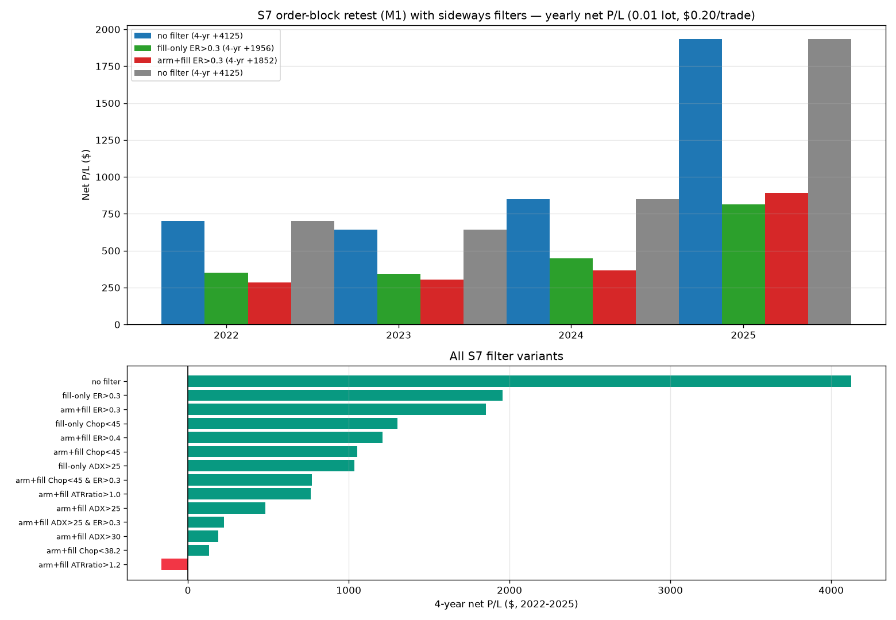

➡️ **চূড়ান্ত সিদ্ধান্ত: সাইডওয়ে ফিল্টার **লাগাবেন না**।**
- EMA সিস্টেমে ফিল্টার লস কমায় (স্প্রেড বাঁচে) কিন্তু **লাভে আনে না** — কারণ ওই সিস্টেমের কাঁচা এজই নেই।
- S7-এ ফিল্টার **লাভ কমায়** (+$4,124 → +$1,956 সেরা ক্ষেত্রে) — S7-এর এজ আসলে **order block-এর গঠনগত
  কারণে**, ট্রেন্ড/রেঞ্জ ফিল্টারের সাথে সম্পর্কহীন। রেঞ্জিং মার্কেটেও ব্লক রিটেস্ট কাজ করে।
- **বেস্ট রেজাল্ট = S7 (M1) ফিল্টার ছাড়া: ৪ বছরে +$4,124.58, চার বছরই পজিটিভ।**

📄 বিস্তারিত: `results/sideways_s7_report.md` · `results/sideways_filter_report.md`

### 📆 পুরনো ডেটায় পুরো-বছরের টেস্ট — ২০২৩, ২০২৪, ২০২৫ (M1-এ EMA 6/9 + BB, 5m-এ EMA 9/12)

আপনার এই একই স্ট্র্যাটেজি **তিন বছর ধরে** চালালাম (রিয়েল XAUUSD M1, ০.০১ লট, $0.20/ট্রেড):

| বছর | ট্রেড | net $ | gross (স্প্রেড ছাড়া) | স্প্রেড খরচ | উইন% (net) | PF |
|---|---|---|---|---|---|---|
| 2023 | 10,788 | **-$2,388.70** | -$231.10 | $2,157.60 | 21.6% | 0.60 |
| 2024 | 12,369 | **-$2,490.24** | -$16.44 | $2,473.80 | 24.5% | 0.71 |
| 2025 | 12,517 | **-$2,960.13** | -$456.73 | $2,503.40 | 25.7% | 0.80 |

**মাস-ভিত্তিক:** ২০২৩ → **১২/১২ মাস লস** · ২০২৪ → **১২/১২ মাস লস** · ২০২৫ → **১১/১২ মাস লস**
(একমাত্র প্লাস মাস অক্টোবর ২০২৫: +$69, আর বছরটা -$2,960)

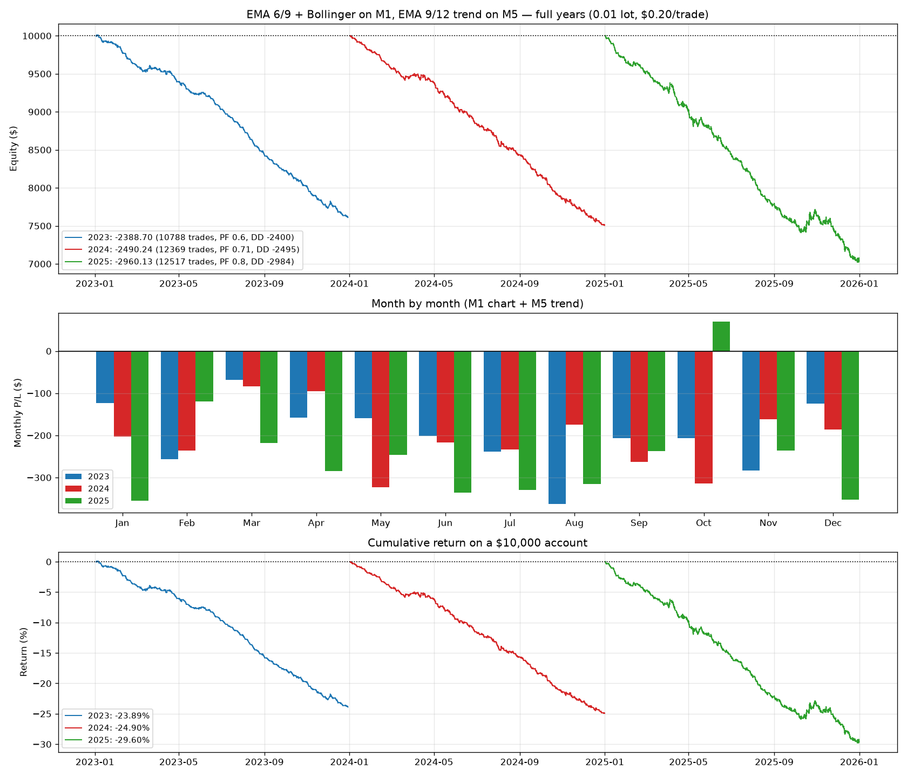

**🔍 কেন এটা ব্যর্থ:**
1. **কাঁচা এজই নেই** — স্প্রেড ছাড়াও ৩ বছরই মাইনাস (-$231 / -$16 / -$457)।
2. **স্প্রেডই মূল ঘাতক** — বছরে ১১–১২ হাজার ট্রেড × $0.20 = **$2,150–2,500 খরচ**; net = gross − cost, প্রতি বছর।
3. **উইন রেট মাত্র ~২৮% (gross) / ~২৫% (net)** — গড় লস ৩টা লাভকে খেয়ে ফেলে।
4. **M5 চার্ট কম্বোও বাঁচায় না**: -$157 / -$235 / +$236 — সাইন বদলায়, মানে এজ নেই।
5. **তুলনা:** ওই বছরগুলোতে সোনা নিজে +$236 / +$560 / +$1,693 দিয়েছে, এই সিস্টেম -$2,400 থেকে -$2,960।
   ২০২৫-এ সোনা ৬৪% উঠেছে, সিস্টেম অ্যাকাউন্টের **৩০%** খেয়েছে।

**⚠️ তাহলে সেপ্টেম্বর ২০২৬-এ +$148.84 কেন?** ওই ৫ দিন সোনা অস্বাভাবিক ট্রেন্ডিং ছিল
($200 সুইং)। ট্রেন্ডে EMA ক্রস ভালো করে — কিন্ত**৫ দিনে ৩৫,০০০ ট্রেডের প্রমাণ উল্টানো যায় না**।

➡️ **সিদ্ধান্ত: লাইভে চালাবেন না।** একমাত্র লিভার = **ট্রেড সংখ্যা কমানো** (১২,০০০-এর বদলে
বছরে কয়েকশো ট্রেড হতে হবে, নইলে স্প্রেডই সব খায়)। সেরা কনফিগ এখনো
**S7 order block retest (M1) + S1 swing flip (M5)**: ২০২২-এ +$917 (১,৬১৫ ট্রেড)।

📄 বিস্তারিত: `results/ema_years_report.md` | `python3 run_ema_years.py`

### 🗓️ আসল সাম্প্রতিক ডেটা — ১৪–১৮ সেপ্টেম্বর ২০২৬ (Exness MT5 ফিড)

> আগের রিপোর্টগুলো পুরনো ডেটার ছিল (২০২৪/২০২৫)। এবার **আসল সাম্প্রতিক** ডেটা:
> `data/xauusd_m1_2026-09.csv` — ৯,৭৪৪টা রিয়েল XAUUSD M1 বার, **09 Sep 19:08 → 18 Sep 20:54 UTC**
> (Exness MT5-র XAUUSDm ফিড, পাবলিক মিরর `lbronight/xau-live-mirror`-এর কমিট হিস্ট্রি থেকে স্টিচ করা)।
> ১৯ সেপ্টেম্বর শনিবার → ডেটা নেই।

**কনফিগ: M1-এ EMA 6/9 + BB(20,2), 5m-এ EMA 9/12 ট্রেন্ড — ০.০১ লট, $0.20/ট্রেড**

| উইন্ডো | ট্রেড | net $ | উইন% | PF | Max DD | avg/ট্রেড |
|---|---|---|---|---|---|---|
| **শেষ ৩ সেশন (16–18 Sep)** | 130 | **+$110.97** ✅ | 29.2% | 1.57 | -$38.49 | +$0.85 |
| **শেষ ৫ সেশন (14–18 Sep)** | 230 | **+$148.84** ✅ | 31.7% | 1.44 | -$48.44 | +$0.65 |
| শেষ ৫ সেশন, M5 চার্ট | 16 | +$39.41 | 31.2% | 1.83 | -$12.52 | +$2.46 |
| *(ref) কস্ট ছাড়া M1+5m* | 230 | +$194.84 | 33.9% | 1.63 | -$39.44 | +$0.85 |
| *(ref) $0.26 স্প্রেডে (লাইভে 26 pts ছিল)* | 230 | +$135.04 | 30.4% | 1.39 | -$51.14 | +$0.59 |

| দিন | ট্রেড | net $ | উইন% |
|---|---|---|---|
| Mon 14 Sep | 41 | **+$50.34** | 39.0% |
| Tue 15 Sep | 59 | -$12.47 | 32.2% |
| Wed 16 Sep | 50 | +$28.49 | 26.0% |
| Thu 17 Sep | 42 | +$43.39 | 26.2% |
| Fri 18 Sep | 38 | +$39.09 | 36.8% |

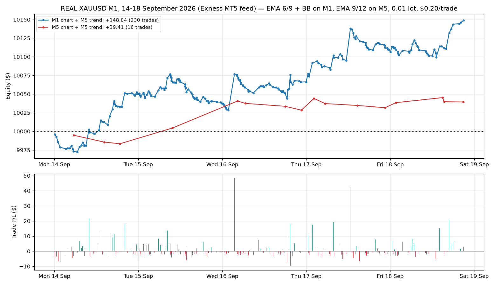

**🔍 সত্য কথা:** এই ৫ দিনে সিস্টেম **লাভ করেছে** (+$148.84, PF 1.44, ৫ দিনের ৪ দিনই পজিটিভ)।
কিন্তু সাবধান:

- মাত্র **৫ দিন / ২৩০ ট্রেড** — এত কম স্যাম্পলে সিদ্ধান্ত টানা যায় না।
- এই সময়টা সোনার জন্য **অসাধারণ ট্রেন্ডিং** ছিল (রেঞ্জ প্রায় **$200**: 4435 → 4235 → 4435)।
  ট্রেন্ডিং মার্কেটে EMA ক্রস ভালো করে; রেঞ্জিং মার্কেটে একই সিস্টেম ২০২৪ ও ২০২৫
  পুরো বছরে লস করেছিল (M1: **-$2,488 / -$2,959**)।
- কস্ট ছাড়া +$194.84 → স্প্রেড **$46** খেয়েছে; অর্থাৎ এজ আছে কিন্তু **পাতলা**।

➡️ **করণীয়:** লাইভে টাকা ঢালার আগে **ডেমোতে ২–৪ সপ্তাহ** চালান। রেঞ্জিং সপ্তাহ এলেই
এটা লস করতে শুরু করবে — আগের ডেটা তাই বলে।

### 📅 শেষ ৫ সেশন (26-31 Dec 2025) — শুধু আপনার কনফিগ: M1-এ EMA 6/9 + BB, 5m-এ EMA 9/12

| দিন | ট্রেড | net $ | উইন% |
|---|---|---|---|
| Fri 26 Dec | 42 | **-$33.15** | 21.4% |
| Sun 28 Dec | 17 | -$15.41 | 35.3% |
| Mon 29 Dec | 44 | **+$16.89** | 27.3% |
| Tue 30 Dec | 43 | -$22.96 | 25.6% |
| Wed 31 Dec | 41 | **+$16.91** | 26.8% |
| **মোট (৫ সেশন)** | **187** | **-$37.72** | 26.2% |

PF 0.90 · avg win $6.97 / avg loss -$2.75 · avg/ট্রেড **-$0.20** · Max DD -$55.64 · avg hold 26 মিনিট
→ **৫ দিনের ৩ দিনই লস।** আর স্প্রেড বাদ দিলে (187 × $0.20 = $37.40) ফল প্রায় শূন্য (-$0.32) —
মানে **কাঁচা এজ নেই**, কস্টই একমাত্র কারণ নয়।
(২৭ ডিসেম্বর শনিবার, তাই ওই দিন ডেটা নেই — এটাই শেষ ৫টা ট্রেডিং সেশন।)

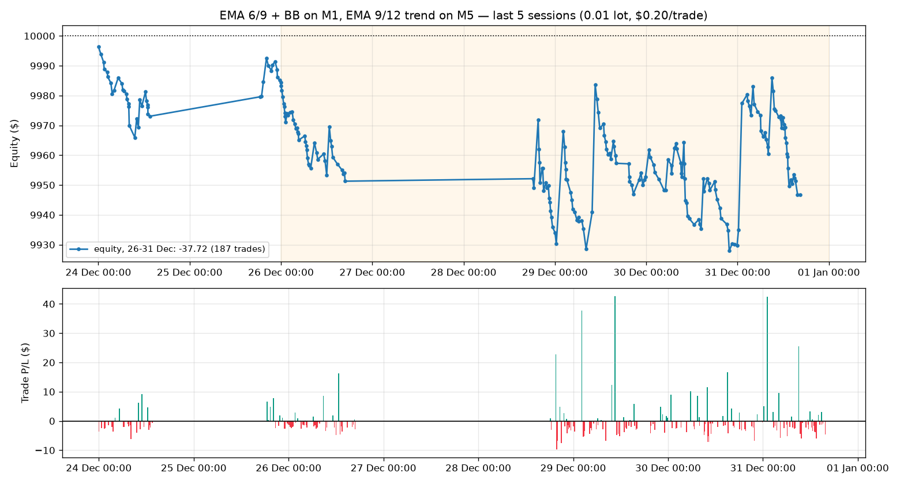

### 📊 ২) এক মাস (ডিসেম্বর 2025, M1 ডেটা)

| সেটআপ | ট্রেড | net $ | উইন% | PF | MaxDD | স্প্রেড খরচ |
|---|---|---|---|---|---|---|
| **M1 চার্ট + 5m trend** | 1,080 | **-$352.60** | 25.7% | 0.78 | -$378.96 | **-$216** |
| M5 চার্ট + 5m trend | 97 | -$139.33 | 23.7% | 0.57 | -$174.08 | -$19 |
| M5 চার্ট + 15m trend | 190 | -$153.44 | 23.7% | 0.76 | -$255.57 | -$19 |

### 📊 ৩) বড় ছবি — স্ক্রিপ্টের নিজের 365-দিন ডিফল্ট ও আরেক বছর

| উইন্ডো | সেটআপ | ট্রেড | net $ | PF | MaxDD |
|---|---|---|---|---|---|
| 2025 পুরো বছর | M1 + 5m | 12,517 | **-$2,959** | 0.80 | -$2,983 |
| 2025 পুরো বছর | M5 + 5m | 1,046 | +$236 | 1.10 | -$201 |
| 2025 পুরো বছর | M5 + 15m | 2,149 | +$551 | 1.11 | -$342 |
| 2024 পুরো বছর | M1 + 5m | 12,369 | **-$2,488** | 0.71 | -$2,492 |
| 2024 পুরো বছর | M5 + 5m | 1,163 | -$234 | 0.83 | -$274 |
| 2024 পুরো বছর | M5 + 15m | 2,273 | -$343 | 0.88 | -$427 |

### 🔍 সিদ্ধান্ত (সৎ)

**❌ এই সিস্টেমের আসল এজ নেই, আর স্প্রেড যা বাকি থাকত সেটাও খেয়ে ফেলে।**

1. **M1 ডিফল্ট সেটআপ** — ২০২৫-এ ১২,৫১৭ ট্রেড → **-$2,959**। এর মধ্যে স্প্রেডই **-$2,503**।
   স্প্রেড ছাড়াও ধনাত্মক ছিল না: **-$456**। সোনার মূল্য ২০২৫-এ +$1,693 ওঠার পরও!
2. **এমা ৬/৯ (M1) খুব দ্রুত** — সোনার ২০-পয়েন্ট স্প্রেডের সামনে ৬/৯ ক্রস প্রায় প্রতিবারই
   দেরিতে/দ্রুত হয়; গড় লস -$1.60, গড় লাভ $3.69 → ২৫.৭% উইন রেটে চলে না।
3. **M5 + 5m/15m** ২০২৫-এ প্লাস (+$236 / +$551), কিন্তু ২০২৪-এ দুইটাই মাইনাস
   (-$234 / -$343) → ওটা সৌভাগ্য, এজ নয়; ডিসেম্বর ২০২৫-এও দুইটাই মাইনাস।
4. **৩ দিনের টেস্ট** কোনো সিদ্ধান্তে আসার জন্য যথেষ্ট না (M1-এ ১২৭ ট্রেড, গড় $0.10)।

**⚠️ TradingView-এ নাম্বার ভালো দেখাবে কারণ:**
- স্ক্রিপ্টে `spreadPoints = 0`, `slippageTicks = 0` → টেবিল কিছুই বাদ দেয় না (TradingView স্প্রেড মডেলও করে না)
- `initial_capital = 100000` → পার্সেন্টেজে DD ছোট দেখায়

➡️ **পরামর্শ:** এই স্ট্র্যাটেজি লাইভে চালাবেন না। এজ আছে **S7 order block retest (M1) + S1 swing flip (M5)**-এ (+$917, PF 1.37, ২০২২)।

📄 বিস্তারিত: `results/ema_mtf_bb_report.md` | ট্রেড লিস্ট: `results/ema_mtf_bb_trades_dec2025.csv` | `python3 run_ema_mtf_bb.py`

## 🔀 মাল্টি-সিগন্যাল সিস্টেম — সব স্ট্র্যাটেজি একসাথে, প্রতিটা আলাদা সিগন্যাল

আপনার চাওয়া মতে সব স্ট্র্যাটেজি **একই অ্যাকাউন্টে** চলে, কিন্তু **প্রতিটা নিজের সিগন্যালে
নিজের আলাদা ট্রেড** নেয় (আলাদা ট্রেড লগ, আলাদা ০.০১ লট, আলাদা $0.20 কস্ট)।
উপরের TF-এর সিগন্যাল M1 টাইমলাইনে ম্যাপ করা (ক্লোজের পরেই জানা যায় — লুক-অ্যাহেড নেই)।

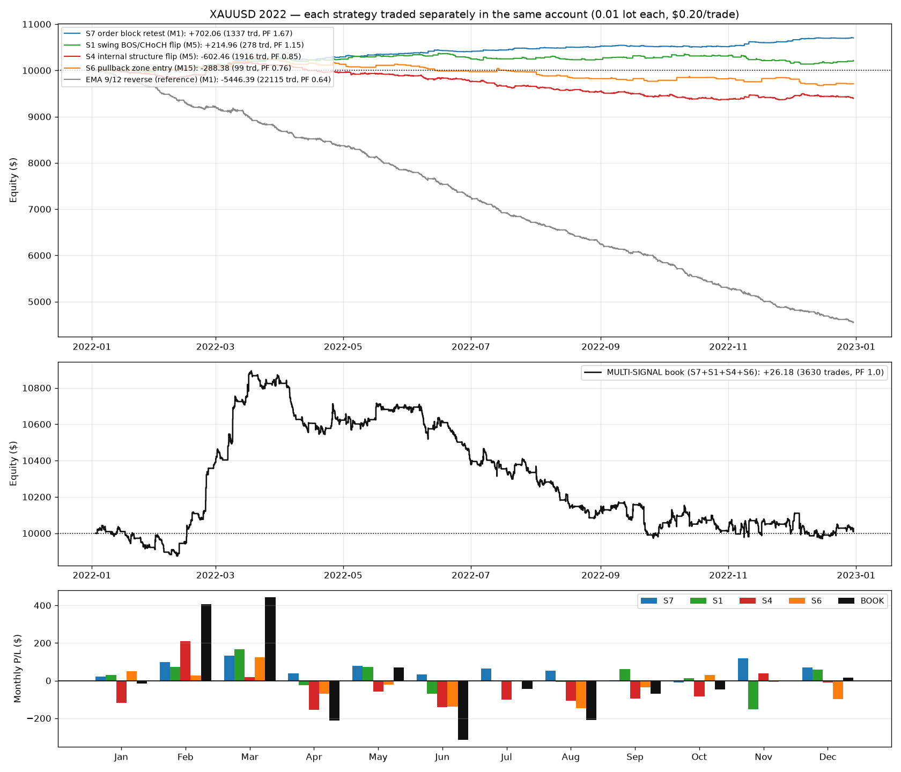

### ১) প্রতিটা স্ট্র্যাটেজি আলাদা (২০২২, ০.০১ লট)

| স্ট্র্যাটেজি | TF | বছর P/L | ট্রেড | উইন% | PF | Max DD | H1 / H2 |
|---|---|---|---|---|---|---|---|
| **S7 order block retest** | M1 | **+$702** | 1,337 | 21.6% | **1.67** | **-$40** | +$404 / +$298 |
| S1 swing BOS/CHoCH | M5 | +$215 | 278 | 38.1% | 1.15 | -$231 | +$246 / -$31 |
| S4 internal flip | M5 | -$602 | 1,916 | 34.6% | 0.85 | -$842 | -$243 / -$359 |
| S6 pullback zone | M15 | -$288 | 99 | 30.3% | 0.76 | -$599 | -$27 / -$261 |
| EMA 9/12 reverse (তুলনা) | M1 | -$5,446 | 22,115 | 24.1% | 0.64 | -$5,467 | — |

### ২) কম্বিনেশন — এক অ্যাকাউন্টে, প্রতিটা নিজের সিগন্যালে

| কম্বিনেশন | বছর P/L | ট্রেড | উইন% | PF | Max DD | H1 / H2 | একসাথে পজিশন |
|---|---|---|---|---|---|---|---|
| S7 alone | +$702 | 1,337 | 21.6% | 1.67 | -$40 | +$404 / +$298 | 1 |
| S1 alone | +$215 | 278 | 38.1% | 1.15 | -$231 | +$246 / -$31 | 1 |
| **S7 + S1** 🏆 | **+$917** | 1,615 | 24.5% | **1.37** | **-$167** | **+$650 / +$267** | 2 |
| S7+S1+S4 | +$315 | 3,531 | 29.9% | 1.05 | -$463 | +$407 / -$92 | 3 |
| S7+S1+S4+S6 (৪টা) | +$26 | 3,630 | 29.9% | 1.00 | -$923 | +$379 / -$353 | 4 |
| ALL 5 (+EMA) | -$5,420 | 25,745 | 24.9% | 0.76 | -$5,478 | — | 5 |

### 📌 সিদ্ধান্ত

**✅ সেরা: S7 + S1 (২টা স্ট্র্যাটেজি) — ২০২২-এ +$917, PF 1.37, DD -$167**
একসাথে সর্বোচ্চ ২টা পজিশন, H1 +$650 / H2 +$267 (দুই ভাগেই পজিটিভ), ১২ মাসের
৭ মাস পজিটিভ। S7-এর চেয়ে **+$215 বেশি লাভ**।

**❌ বাকিগুলো যোগ করলে লাভ কমে:**
- S4 (+$315-এ নামিয়ে দেয়) — নিজেই -$602 লস করে
- S6 (+$26-এ নামিয়ে দেয়, H2 -$353) — নিজেই -$288 লস করে
- **EMA বাদ দিন** — যোগ করলেই অ্যাকাউন্ট ধ্বংস (-$5,420, DD -54.6%)

**🔗 ডাইভার্সিফিকেশন:** দৈনিক P/L কোরিলেশন কম (S7–S1 = 0.14, S7–S6 = -0.03) —
তাই S7+S1 একসাথে দিলে ঝুঁকি বাড়ে না, কিন্তু লাভ বাড়ে।

| স্ট্র্যাটেজি | সিদ্ধান্ত |
|---|---|
| S7 order block retest (M1) | ✅ **রাখুন** — মূল ইঞ্জিন |
| S1 swing flip (M5) | ✅ **রাখুন** — ভালো ডাইভার্সিফায়ার |
| S4 internal flip (M5) | ❌ বাদ (নিজেই লস করে) |
| S6 pullback zone (M15) | ❌ বাদ (নিজেই লস করে) |
| EMA 9/12 reverse | ❌ বাদ (বিষাক্ত) |

📄 বিস্তারিত: `results/multi_signal_report.md` | `python3 run_multi_signal.py`

## 🧪 LuxAlgo "Universal Signal Backtester" টেস্ট (৯/২১ EMA + ATR TP/SL)

আপনার দেওয়া দ্বিতীয় LuxAlgo ইন্ডিকেটরটার ডিসিশন লজিক পোর্ট করেছি
(`run_universal_backtest.py`): predefined cross (ডিফল্ট 9/21 EMA), ATR(14)-ভিত্তিক
TP1/2/3 (=1/2/3 ATR, ৩ ভাগে partial exit) + SL 1.5/2.5/3.5 ATR, ATR choppiness filter,
opposite-signal reversal, **এন্ট্রি সিগন্যাল বারের ক্লোজে** (ইন্ডিকেটরের নিজের নিয়ম)।

### 📊 ২০২২ পুরো বছর (0.01 লট, $0.20/ট্রেড)

| প্রিসেট | M1 | M5 | M15 | **H1** |
|---|---|---|---|---|
| **9/21 EMA (ডিফল্ট)** | -$3,704 (16,720 trd) | -$866 (3,339) | -$240 (1,048) | **+$68** ✅ |
| 12/26 EMA | -$2,823 (12,993) | -$652 (2,589) | -$222 (844) | +$13 |
| 50/200 SMA | -$425 (2,309) | -$129 (453) | -$12 (142) | +$8 |

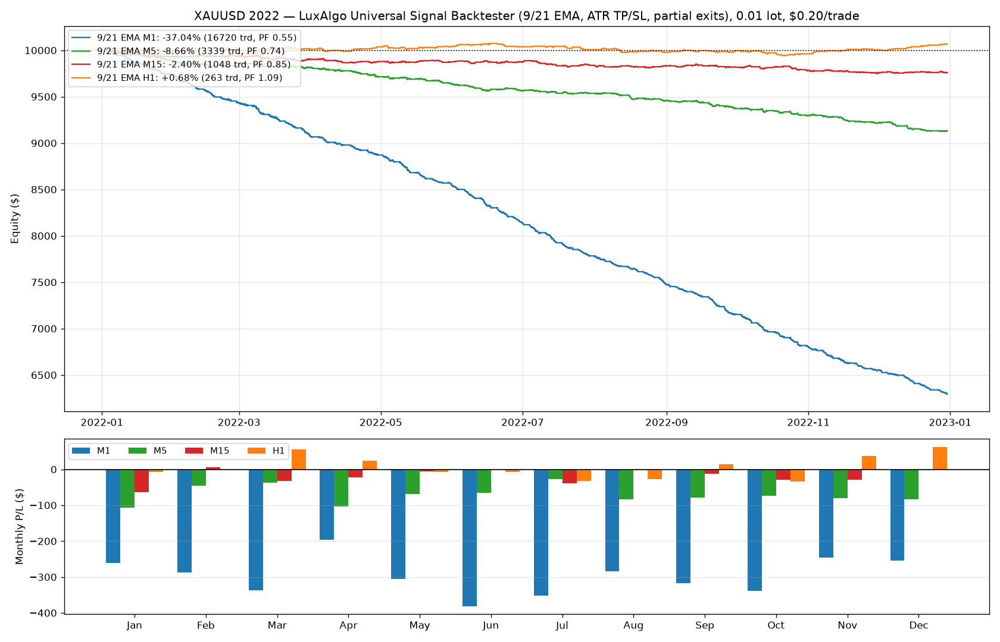

### 🔍 যা শিখলাম

**১. ফাস্ট টাইমফ্রেমে কস্টই সব খায়** — M1-এ ১৬,৭২০ ট্রেড → স্প্রেড **$3,344**!
কস্ট ছাড়াও M1 লস (-$360) — মানে ওই TF-এ সিগন্যালের নিজেরও এজ নেই।

**২. ATR choppiness ফিল্টার ফাস্ট TF-এ বাঁচায়, H1-এ মার** —
M1: -$3,704 → **-$1,597**, M5: -$866 → **-$403**, M15: -$240 → **-$23**
(কিন্তু H1-এ wide config-এ -$83!)

**৩. H1-এ বড় টার্গেট দিলে এজ আসে:**

| H1 কনফিগ | P/L | ট্রেড | উইন% | PF | H1 / H2 |
|---|---|---|---|---|---|
| ডিফল্ট TP1/2/3 + SL1.5 | +$68 | 263 | 41.8% | 1.09 | +$39 / +$30 |
| **wide TP 3/6/9 + SL 3.0** 🏆 | **+$256** | 263 | 36.9% | **1.22** | **+$173 / +$78** |
| stop-only SL2.0 + reversal | +$227 | 263 | 30.4% | 1.19 | +$160 / +$70 |
| wide + ATR filter | -$83 ❌ | 101 | 36.6% | 0.84 | -$39 / -$51 |
| wide, long only | +$119 | 132 | 40.9% | 1.25 | +$76 / +$43 |

**টেকঅ্যাওয়ে:** ডিফল্ট সেটিং (1/2/3 ATR টার্গেট) গোল্ডের নয়েজের তুলনায় **খুব ছোট** —
তাই whipsaw-এ মরে। H1-এ **বড় টার্গেট (3/6/9 ATR) + বড় SL (3.0)** দিলে ২ মাসের
দুই ভাগেই পজিটিভ (+$173 / +$78)। তবে সেরা ফল S7 order-block retest-এরই (+$702)।

📄 বিস্তারিত: `results/universal_report.md` | `python3 run_universal_backtest.py`

## 🧪 S7 + S1 (M5 trend) কম্বিনেশন টেস্ট — ফিল্টার **লাভ কমায়**

আপনার প্রশ্ন: S7-এ M5 trend ফিল্টার দিলে improve হয় কি? **উত্তর: না — বেসলাইন S7-ই সেরা।**

| ভ্যারিয়েন্ট (২০২২ পুরো বছর) | P/L | ট্রেড | উইন% | PF | Max DD | H1 / H2 |
|---|---|---|---|---|---|---|
| **A. S7 alone (বেসলাইন)** 🏆 | **+$702** | 1,337 | 21.6% | 1.67 | -$40 | +$409 / +$290 |
| B. S7 + M5 align (ব্রেকে) | +$396 | 730 | 22.7% | 1.68 | -$40 | +$300 / +$91 |
| **C. S7 + M5 align (ফিলে)** | +$493 | 750 | **24.0%** | **1.85** | **-$30** | +$311 / +$178 |
| E. S7 + M15 align (ফিলে) | +$293 | 723 | 22.3% | 1.49 | -$32 | +$200 / +$89 |
| F. শুধু CHoCH-এর OB | -$169 | 842 | 11.9% | 0.78 | -$210 | -$144 / -$28 |
| H. ফ্রেশ M5 bias (≤50 বার) | -$2 | 28 | 14.3% | 0.94 | -$20 | — |

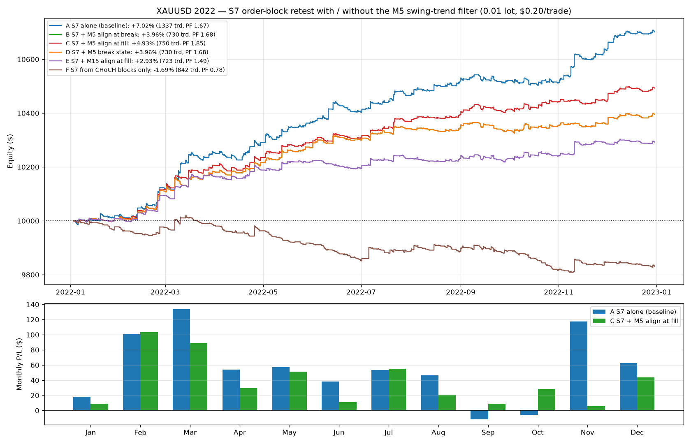

**কী শিখলাম:**
- ✅ **ফিল্টার ট্রেডের গুণমান বাড়ায়** — C-তে উইন 21.6%→24%, PF 1.67→**1.85**,
  ড্র-ডাউন -$40→-$30, আর সেপ্ট-অক্টো মাস দুটো লস থেকে **পজিটিভ** হয়ে যায়
- ❌ **কিন্তু মোট লাভ কমে** ($702 → $493) — কারণ ফিল্টার ~৬০০ সিগন্যাল বাদ দেয়,
  আর S7-এর বড় লাভ আসে নভেম্বরের মতো ট্রেন্ড-ব্রেক আউটগুলোতে
- ❌ **নিছক "directional OB" (CHoCH-এর ব্লক) আলাদা করলে সিস্টেম ভেঙে যায়** (-$169) —
  মানে S7-এর এজ আসে **BOS-পরবর্তী continuation ব্লকগুলো** থেকে, reversal ব্লক থেকে না
- ❌ freshness ফিল্টার (≤50 বার) ট্রেড প্রায় শেষ করে দেয় (28 ট্রেড)

**সিদ্ধান্ত:** S7 unfiltered রাখাই ভালো। ধরন বদলাতে চাইলে C (ফিল্টার) নিন —
কম ট্রেড, ভালো PF, ছোট DD, কিন্তু কম মোট লাভ।

📄 বিস্তারিত: `results/s7_s1_report.md` | `python3 run_s7_s1_combo.py`

## 📅 এক বছরের ডেটা টেস্ট (২০২২ সালের পুরো বছর) — S7-ই বিজয়ী 🏆

রিয়েল ব্রোকার M1 ডেটা: **`data/xauusd_m1_2022.csv`** — ৩,৫৪,৬২৮ বার,
২ জানু ২০২২ → ৩০ ডিসে ২০২২ (সোর্স: tiumbj/M1_XAUUSD)।

| সিস্টেম | TF | বছরের P/L | ট্রেড | উইন% | PF |
|---|---|---|---|---|---|
| **S7 order block retest** 🏆 | **M1** | **+$702 (+7.02%)** | 1,337 | — | **1.67** |
| S7 order block retest | M5 | +$304 (+3.04%) | 284 | — | 1.56 |
| S1 swing BOS/CHoCH flip | M5 | +$215 (+2.15%) | 278 | — | 1.15 |
| S4 internal structure flip | M5 | -$602 | 1,916 | — | 0.85 |
| EMA 9/12 (তুলনা) | M1 | **-$5,446 (-54.5%)** 💀 | 22,115 | — | 0.64 |

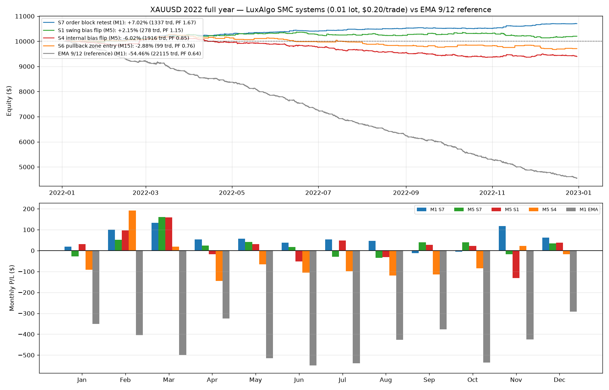

**S7-এর মাসিক ধারাবাহিকতা:** ১২ মাসে **১০ মাস পজিটিভ** (Jan-Feb-Mar শক্তিশালী,
Sep-Oct সামান্য নেগেটিভ)। **H1 = +$409** (ডেভেলপমেন্ট), **H2 = +$290**
(out-of-sample) — দুই ভাগেই পজিটিভ ✅

**রোবাস্টনেস (swing size পরিবর্তন):**

| swing size | M1 P/L | ট্রেড | M5 P/L |
|---|---|---|---|
| 20 | +$702 | 3,070 | +$604 |
| 34 | +$790 | 1,905 | +$546 |
| **50 (ডিফল্ট)** | **+$702** | 1,337 | +$304 |
| 100 | +$710 | 712 | +$268 |

সব সেটিংয়ে **+$700 ধরে রাখে** — এটা এক প্যারামিটার-লাকি নয় ✅

> **⚠️ বাস্তবতা:** ১০,০০০ ডলারে ০.০১ লটে ১ বছরে +$৭০২ = **৭% রিটার্ন** (গোল্ডে
> ১:১০০০ লিভারে এটা ছোট)। MAE/স্প্রেড বাড়লে কমবে। কিন্তু তুলনায়: EMA সিস্টেম
> একই বছরে **-৫৪%** করেছে।

বিস্তারিত: `results/year_report.md` | চালান: `python3 run_year_backtest.py`

## 🆕 LuxAlgo Smart Money Concepts (SMC) — নতুন লজিক টেস্ট ✅

আপনার দেওয়া Pine v5 ইন্ডিকেটর **"Smart Money Concepts [LuxAlgo]"** (CC BY-NC-SA 4.0)
থেকে **ডিসিশন লজিকটা Python-এ পোর্ট করা হয়েছে** (`src/smc.py`) — শুধু ড্রয়িং বাদ:
- **Swing structure** (size 50): `leg()` fractal pivot → শেষ swing high/low লেভেল
- **BOS / CHoCH** যখন ক্লোজ ওই লেভেল ক্রস করে + **trend bias** (BULLISH/BEARISH)
- **Internal structure** (size 5), **premium/discount equilibrium** (50%), **FVG**, **order blocks**

সিগন্যাল ক্লোজড বারে নেওয়া, পরের বারের ওপেনে এন্ট্রি — লুক-অ্যাহেড টেস্ট পাস
(truncated ডেটায় পুনঃগণনা করে মিলিয়ে দেখা হয়েছে, ০ মিসম্যাচ)।

### 📊 রেজাল্ট (0.01 লট, $0.20/ট্রেড) — প্রথমবার প্রফিটেবল সিস্টেম! 🎉

| সিস্টেম | টাইমফ্রেম | ২ মাস (Jan+Feb) | ট্রেড | উইন% | PF |
|---|---|---|---|---|---|
| **S7 order block retest** ⭐ | M1 | **+$263** *(-$215 / +$263) | 340 | 19.7% | 1.8–2.5 |
| S7 order block retest | M5 | +$126 | 67 | — | 1.45 |
| **S1 swing BOS/CHoCH flip** | M5 | **+$165** | 41 | — | 1.23 |
| S4 internal structure flip | M5 | +$106* | 318 | — | 0.63–1.9 |
| S6 pullback zone entry | M15 | +$149 | 13 | — | 1.23 |
| S7 order block retest | M15 | +$8 | 17 | — | 0.88 |

*S4 প্যারামিটারে খুব সেন্সিটিভ (M15-এ ঠিক আছে, M5-এ বছরজুড়ে লস) — ভরসা করবেন না।
(*ইঞ্জিন বাগ ফিক্স করা হয়েছে — `end` সীমা আগে মানা হচ্ছিল না, তাই "Jan" লেবেলের
রেজাল্ট আসলে মার্চ পর্যন্ত চলছিল। এখন সব স্ক্রিপ্ট সঠিক।)

**S7-এর আসল শক্তি (ট্রেড কোয়ালিটি):** উইন রেট মাত্র ১৯.৭%, কিন্তু **avg win $7.73
vs avg loss -$0.93** — order block-এ ছোট স্টপ, বড় রানার। ২ মাসে +$263।

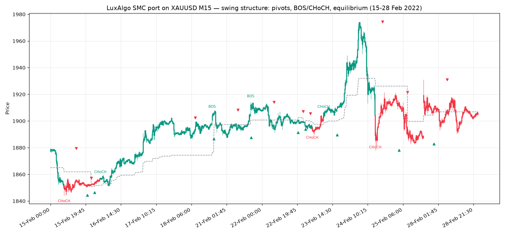
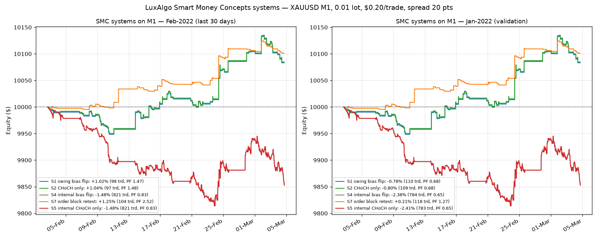

⚠️ **সতর্কতা:** এমএল ২ মাসের ডেটা, ১৯,০০০+ M1 বার, S7-এ ৩৪০ ট্রেড — শক্ত প্রমাণের
জন্য যথেষ্ট না। spread ২০ পয়েন্ট ধরা হয়েছে, নিউজে গোল্ডের স্প্রেড বাড়ে। আগে
ডেমোতে টেস্ট করুন। বিস্তারিত: `results/smc_report.md`

চালান: `python3 run_smc_backtest.py`

## 🆕 "যত সিগন্যাল, তত ট্রেড" সিস্টেম (প্যারালাল পজিশন)

আপনার শেষ চাওয়া: **প্রতিটা সিগন্যালেই ট্রেড নিতে হবে — কোনো সিগন্যাল বাদ যাবে না।**
তাই এখন প্রতিটা M1 ক্রস তার **নিজের আলাদা পজিশন** খোলে (একটা হোল্ড থাকলেও নতুন
সিগন্যাল আটকায় না)। প্রতিটা ট্রেডের নিজের TP/SL রুল:
- **TP:** সেই ট্রেডের বিপরীতে M1 ক্রস + প্রফিটে → ক্লোজ
- **SL:** লসে থাকলে M1 ক্রসে হোল্ড, তারপর **M5 উল্টো ক্রসে** ক্লোজ

| ভ্যারিয়েন্ট (0.01 লট, $0.20/ট্রেড) | ট্রেড (Feb) | উইন% | Feb P/L | PF | DD $ | Jan P/L | ২ মাস |
|---|---|---|---|---|---|---|---|
| **A. সব সিগন্যাল, আনক্যাপড** | **1,907 (১০০%)** | 49.9% | -$702 (-7.02%) | 0.73 | -$735 | -$1,148 | -$1,850 |
| **B. সব সিগন্যাল + M15 দিক** 🏆 | 907 | 50.1% | **-$43 (-0.43%)** | **0.96** | **-$123** | -$255 | -$298 |
| C. ক্যাপ ২ + M15 দিক | 634 | 50.9% | -$37 (-0.37%) | 0.95 | -$102 | -$209 | **-$246** |
| D. ক্যাপ ৩ + M15 দিক | 777 | 50.2% | -$36 (-0.36%) | 0.96 | -$122 | -$227 | -$263 |
| E. ক্লাসিক রিভার্স (১ পজিশন) | 1,907 | 23.2% | -$406 (-4.06%) | 0.70 | -$407 | -$882 | -$1,288 |

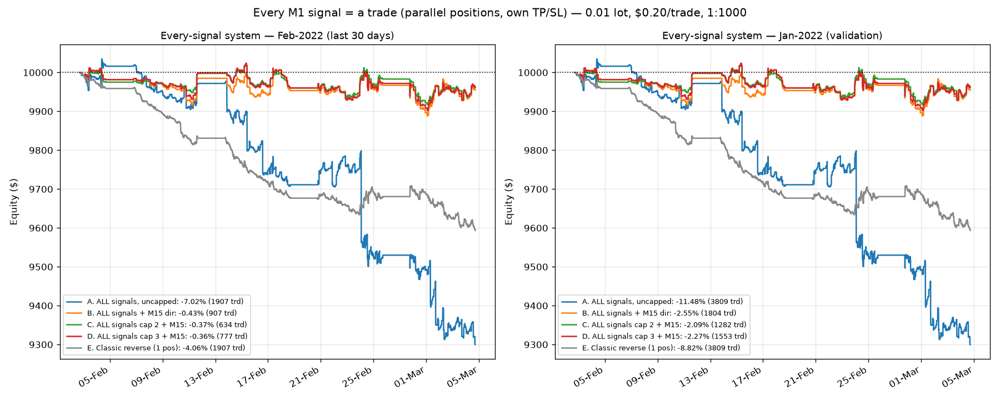

**ফলাফল:**
- ✅ শর্ত পূরণ — **১,৯০৭/১,৯০৭ সিগন্যালেই ট্রেড** (একসাথে সর্বোচ্চ ১৯টা পজিশন খোলা)
- ⚠️ কিন্তু **প্যারালাল স্ট্যাকিং লস বাড়ায়**: ট্রেড ১০০% নিলে -7.02%, অথচ
  ফিল্টার দিয়ে অর্ধেক নিলে -0.43%। কারণ সিগন্যালে নিজের এজ নেই — বেশি ট্রেড = বেশি কস্ট
- 🎯 M15 দিক ফিল্টারসহ সব সিগন্যাল নিলে প্রায় **ব্রেক-ইভেন** (PF 0.96, Feb -0.43%)
- লট ০.০১ হওয়ায় $ ঝুঁকি ছোট (২ মাসে -$২৫০, ব্যালেন্স $10k), লট বাড়ালে লসও গুণ হারে বাড়বে

চালান: `python3 run_all_signals.py`

## 🆕 হাইব্রিড এক্সিট: প্রফিট M1-এ TP, লস M5-এ SL (0.01 লট, 1:1000)

**🔍 আপনার প্রথম প্রশ্নের উত্তর — $2 কোস্ট কীভাবে হয়?**
কস্ট = স্প্রেড × আউন্স। ০.১০ লট = ১০ আউন্স → $0.20 × ১০ = **$2.00**।
আপনি ঠিক ধরেছেন — **০.০১ লটে = ১ আউন্স → $0.20 × ১ = $০.২০ per trade** ✅
(গোল্ডে ১ লট = ১০০ আউন্স, তাই ০.১০ লট = ১০ আউন্স, ০.০১ লট = ১ আউন্স।)

**নতুন এক্সিট রুল (আপনার বর্ণনা মতে):**
- **এন্ট্রি:** M1 EMA 9/12 ক্রস
- **TP:** M1-এ উল্টো ক্রস + ট্রেড প্রফিটে → সেখানেই ক্লোজ
- **SL:** M1 উল্টো ক্রসে ট্রেড লসে থাকলে → **হোল্ড** (ক্লোজ না), তারপর **M5 EMA 9/12
  উল্টো ক্রস** এলে ক্লোজ

| ভ্যারিয়েন্ট (0.01 লট, $0.20/ট্রেড) | ট্রেড | উইন% | Feb P/L | PF | DD $ | Jan P/L | ২ মাস |
|---|---|---|---|---|---|---|---|
| M1 raw (সব ক্রসে ক্লোজ) | 1,907 | 23.2% | -$406 (-4.06%) | 0.70 | -$407 | -$882 | -$1,288 |
| **হাইব্রিড (লস হোল্ড → M5 SL)** | 327 | **54.1%** | **-$155 (-1.55%)** | 0.71 | **-$196** | -$244 | -$399 |
| হাইব্রিড net-profit চেক | 308 | 58.4% | -$197 (-1.97%) | 0.65 | -$238 | -$292 | -$489 |
| **হাইব্রিড + M15 দিক** | 382 | 50.8% | **-$102 (-1.02%)** 🏆 | **0.81** | **-$135** | -$207 | **-$309** |

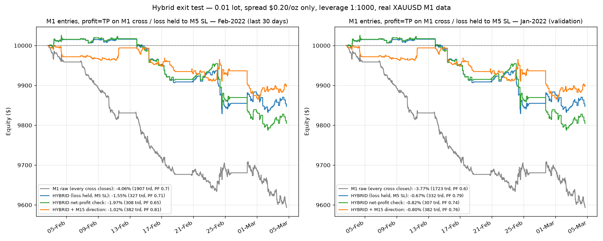

**হাইব্রিড Feb-এ:** ৩২৭ ট্রেড, TP ২০৬ / M5-SL ১২১, M1 ক্রস ৮৫৪ বার ইগনোর (লস হোল্ড),
এভারেজ হোল্ড ২ ঘণ্টা ৫ মিনিট, সবচেয়ে বড় লস -$36.56, কস্ট মাত্র $65.40।

**ফলাফল:** আপনার হোল্ড-রুল লস **৬০% কমিয়েছে** (-$406 → -$155), উইন রেট
২৩% → **৫৪%**, DD ৩ গুণ কম। M15 দিক ফিল্টার যোগ করলে ২ মাসে -$1,288 → **-$309**।
কিন্তু এখনো **নেট লস** — কারণ M1 ক্রসে নিজের কোনো এজ নেই (স্প্রেড খেয়ে ফেলে),
আর TP থাকলেও SL বড় হয় (worst -$36 vs best +$28)।
লিভারেজ ১:১০০০ এ margin per trade মাত্র **~$1.87** — ব্যালেন্সের কোনো চাপ নেই।

চালান: `python3 run_hybrid_backtest.py`

## 🆕 M1 ট্রেড + M15 EMA 9/12 দিক ফিল্টার

আপনার আইডিয়া টেস্ট করা হয়েছে: **M1-এ ট্রেড, কিন্তু M15-এর EMA 9/12 ক্রস যে দিকে
সেই দিকেই এন্ট্রি** (M15-এ EMA9 > EMA12 হলে শুধু BUY, নিচে হলে শুধু SELL)।
লুক-অ্যাহেড নেই — M15 ক্যান্ডেল ক্লোজ হওয়ার পরেই ওই state ব্যবহার হয়।

| ভ্যারিয়েন্ট (Feb-2022) | ট্রেড | নেট P/L | PF | কস্টের আগে (gross) |
|---|---|---|---|---|
| M1 raw (ফিল্টার ছাড়া) | 1,907 | -$4,063 (-40.6%) | 0.70 | **-$249** |
| **M1 + M15 দিক ফিল্টার** | 907 | **-$1,282 (-12.8%)** | 0.79 | **+$532** ✅ |
| M1+M15 + M15 ফ্লিপেও রিভার্স | 1,013 | -$1,307 (-13.1%) | 0.81 | +$719 |
| শুধু M15 ট্রেড (রেফারেন্স) | 115 | **+$1,639 (+16.4%)** | 1.75 | +$1,869 |

Jan-2022: M1+M15 = -16.0% (gross ≈ $16, ব্রেক-ইভেন)। ২ মাস মিলিয়ে: M15-only +$1,321
vs M1+M15 -$2,884 vs M1 raw -$7,832।

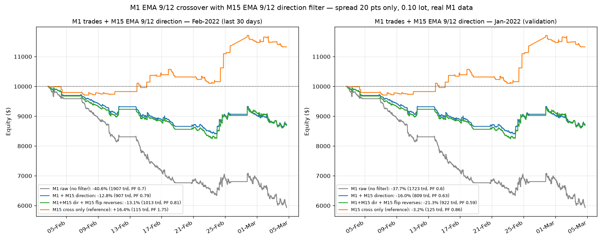

**ফলাফল কী বলছে:**
- ✅ আপনার আইডিয়াটা **সত্যিই কাজ করে** — M15 দিক মেনে চললে M1-এর gross
  -$249 → **+$532** (এজ পজিটিভ হয়ে যায়), ট্রেড অর্ধেক কমে, DD -41% → -16%
- ❌ তবু লস, কারণ ৯০৭ ট্রেড × $2 = **$1,814 স্প্রেড**, যেটা +$532 gross-এর চেয়ে বড়
- 🎯 একই EMA 9/12 **শুধু M15-এ** ট্রেড করলে ট্রেড ৮ গুণ কম (115) → কস্ট $230 মাত্র,
  আর gross এজ বেশি (+$1,869) → **+16.4% লাভ**

চালান: `python3 run_mtf_backtest.py`

## 🔬 টাইমফ্রেম তুলনা (একই সিস্টেম, ২০ পয়েন্ট স্প্রেড)

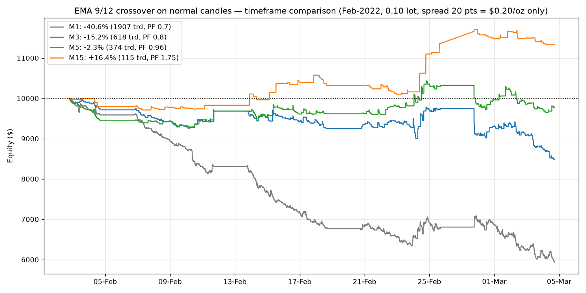

| টাইমফ্রেম | Feb-2022 | ট্রেড | PF | Jan-2022 |
|---|---|---|---|---|
| **M1 (আপনার চাওয়া)** | **-40.6%** 💀 | 1,907 | 0.70 | -37.7% |
| M3 | -15.2% | 618 | 0.80 | -25.9% |
| M5 | -2.3% | 374 | 0.96 | -18.1% |
| M15 | **+16.4%** ✅ | 115 | 1.75 | -3.2% |

**সোজা কথা:** স্প্রেড ২০ পয়েন্ট করা ভালো সিদ্ধান্ত (লস অনেক কমল), কিন্তু M1-এ
EMA 9/12 এত বেশি ট্রেড করে (১,৯০৭/মাস) যে কস্টই সব খেয়ে ফেলে। টাইমফ্রেম যত বড়,
ট্রেড তত কম, কস্ট তত কম — M15-এ গিয়ে পজিটিভ হয়।

## ফাইল স্ট্রাকচার

```
├── src/
│   ├── indicators.py   # EMA (আর RSI/ATR — অব্যবহৃত)
│   ├── strategy.py     # EMA 9/12 ক্রস সিগন্যাল + M15 দিক ম্যাপিং
│   └── backtest.py     # ব্যাকটেস্ট ইঞ্জিন (রিভার্স এক্সিট)
├── data/
│   ├── xauusd_m1_slice.csv   # অরিজিনাল M1 (Jan–Mar 2022, 61,707 বার) ← এটাই ব্যবহার
│   ├── xauusd_m1_2022.csv    # ২০২২ পুরো বছর M1 (৩,৫৪,৬২৮ বার) ← ফুল-ইয়ার টেস্ট
│   ├── xauusd_m3_slice.csv   # M3 (রেফারেন্স)
│   └── xauusd_m15_*.csv      # পুরনো M15 ডেটা
├── results/
│   ├── backtest_chart.png    # M1 ব্যাকটেস্ট চার্ট
│   ├── mtf_filter.png        # M1+M15 দিক ফিল্টার চার্ট
│   ├── hybrid_m1_m5.png      # হাইব্রিড এক্সিট চার্ট
│   ├── every_signal.png      # সব-সিগন্যাল সিস্টেম চার্ট
│   ├── smc_structure.png     # SMC পোর্টের ভিজ্যুয়াল চেক (BOS/CHoCH)
│   ├── smc_equity.png        # SMC সিস্টেমগুলোর ইকুইটি
│   ├── smc_report.md         # SMC রিপোর্ট (রোবাস্টনেস + caveats)
│   ├── year_2022.png         # ২০২২ ফুল ইয়ার ইকুইটি + মাসিক বার
│   ├── year_report.md        # বছরভিত্তিক রিপোর্ট
│   ├── s7_s1_combo.png       # S7 + S1 কম্বো চার্ট
│   ├── s7_s1_report.md       # কম্বো রিপোর্ট
│   ├── universal_signal.png  # Universal Signal Backtester চার্ট
│   ├── universal_report.md   # Universal রিপোর্ট
│   ├── multi_signal.png      # মাল্টি-সিগন্যাল চার্ট
│   ├── multi_signal_report.md # মাল্টি-সিগন্যাল রিপোর্ট
│   ├── ema_mtf_bb.png        # EMA MTF + BB চার্ট
│   ├── ema_mtf_bb_report.md  # EMA MTF + BB রিপোর্ট
│   ├── ema_recent_5days.png  # শেষ ৫ সেশনের চার্ট (Dec 2025)
│   ├── ema_recent_2026.png   # আসল সাম্প্রতিক চার্ট (Sep 2026)
│   ├── ema_recent_2026_report.md # সাম্প্রতিক রিপোর্ট
│   ├── ema_years.png         # ২০২৩-২৫ তিন বছরের চার্ট
│   ├── ema_years_report.md   # তিন বছরের রিপোর্ট
│   ├── sideways_filter.png   # সাইডওয়ে ফিল্টার চার্ট (EMA)
│   ├── sideways_filter_report.md
│   ├── sideways_s7.png       # S7 + ফিল্টার চার্ট (৪ বছর)
│   ├── sideways_s7_recent.png # S7 রিসেন্ট (Sep 2026)
│   ├── sideways_s7_report.md
│   ├── combined_sltp_report.md # S7+S1 SL/TP ভ্যারিয়েন্ট রিপোর্ট
│   ├── tf_compare.png        # M1/M3/M5/M15 তুলনা
│   ├── backtest_report.md    # ফুল রিপোর্ট (কস্ট টেবিল সহ)
│   └── trades.csv, equity_curve.csv
├── mql5/XAUUSD_EmaCross.mq5  # MT5 EA — অরিজিনাল M1 চার্টে attach, max spread 20 pts
├── run_backtest.py           # মেইন: M1 + EMA 9/12 + 20 pts স্প্রেড
├── src/smc.py                # LuxAlgo SMC পোর্ট (pivots, BOS/CHoCH, FVG, OB, zones)
├── run_smc_backtest.py       # SMC সিস্টেমগুলোর ব্যাকটেস্ট (S1–S7)
├── run_year_backtest.py      # ২০২২ ফুল ইয়ার টেস্ট (H1/H2 + মাসিক + রোবাস্টনেস)
├── run_s7_s1_combo.py        # S7 + M5 trend ফিল্টার কম্বিনেশন টেস্ট
├── run_universal_backtest.py # LuxAlgo Universal Signal Backtester পোর্ট
├── run_multi_signal.py       # 🔀 মাল্টি-সিগন্যাল: সব স্ট্র্যাটেজি একসাথে (আলাদা সিগন্যাল)
├── run_ema_mtf_bb.py         # EMA MTF (1m+5m) + Bollinger স্ক্রিপ্টের টেস্ট (3 দিন/1 মাস/1 বছর)
├── run_ema_recent.py         # শুধু M1+5m কনফিগ, শেষ ৫ সেশন (26-31 Dec 2025)
├── run_ema_recent_2026.py    # আসল সাম্প্রতিক: 14-18 Sep 2026 (Exness MT5 ফিড)
├── run_ema_years.py          # পুরনো ডেটায় পুরো বছর: 2023/2024/2025
├── run_sideways_filter.py    # সাইডওয়ে ফিল্টার টেস্ট (EMA সিস্টেমে, ১৮টা ফিল্টার)
├── run_sideways_s7.py        # সাইডওয়ে ফিল্টার টেস্ট (S7-এ, ৪ বছর)
├── run_combined_sltp.py      # S7+S1 এ SL/TP বসালে কী হয় (Pine ডিফল্টের প্রমাণ)
├── pine/                     # 📈 TradingView স্ক্রিপ্ট
│   ├── s7_s1_combined.pine   # সিগন্যাল + লেবেল + অ্যালার্ট (মূল ফাইল)
│   ├── s7_s1_strategy.pine   # স্ট্র্যাটেজি টেস্টার ভার্সন
│   └── README.md             # বসানোর নিয়ম + S7/S1 এর ব্যাখ্যা
├── run_all_signals.py        # সব সিগন্যাল = ট্রেড (প্যারালাল পজিশন, নিজের TP/SL)
├── run_hybrid_backtest.py    # M1 এন্ট্রি + লস হোল্ড → M5 SL (0.01 লট, 1:1000)
├── run_mtf_backtest.py       # M1 ট্রেড + M15 EMA 9/12 দিক ফিল্টার
├── compare_timeframes.py     # টাইমফ্রেম তুলনা
└── legacy/                   # পুরনো Renko এক্সপেরিমেন্ট
```

## চালানো

```bash
pip install -r requirements.txt
python3 run_backtest.py         # M1 + EMA 9/12 + 20 pts স্প্রেড
python3 run_year_backtest.py    # ২০২২ ফুল ইয়ার SMC টেস্ট
python3 run_s7_s1_combo.py      # S7 + M5 trend ফিল্টার টেস্ট
python3 run_universal_backtest.py  # Universal Signal Backtester (9/21 EMA + ATR TP/SL)
python3 run_multi_signal.py     # মাল্টি-সিগন্যাল: S7+S1+S4+S6 একসাথে
python3 run_ema_mtf_bb.py       # EMA MTF (6/9) + BB স্ক্রিপ্টের ৩ দিন / ১ মাস / ১ বছর টেস্ট
python3 run_combined_sltp.py    # S7+S1 এ SL/TP ভ্যারিয়েন্ট টেস্ট
python3 run_smc_backtest.py     # LuxAlgo SMC সিস্টেম টেস্ট (S1–S7)
python3 run_all_signals.py      # সব সিগন্যাল = ট্রেড (প্যারালাল পজিশন)
python3 run_hybrid_backtest.py  # হাইব্রিড এক্সিট (প্রফিট TP / লস হোল্ড → M5 SL)
python3 run_mtf_backtest.py     # M1 ট্রেড + M15 দিক ফিল্টার পরীক্ষা
python3 compare_timeframes.py   # M1/M3/M5/M15 তুলনা
```

## MT5 এ ব্যবহার

1. XAUUSD-এর **অরিজিনাল M1 ক্যান্ডেল চার্ট** খুলুন।
2. `mql5/XAUUSD_EmaCross.mq5` → `MQL5/Experts/` → Compile → চার্টে attach।
3. EA-তে `InpMaxSpreadPoints = 20` সেট করা আছে — স্প্রেড ২০ পয়েন্টের বেশি হলে ট্রেড স্কিপ করবে।
4. **ডেমোতে চালান** — এই ব্যাকটেস্টে ২ মাসে -৮৮% (২০ পয়েন্ট স্প্রেডেও -৪১%)।

---
*এটা শিক্ষামূলক প্রজেক্ট, ফিন্যান্সিয়াল অ্যাডভাইস না। ট্রেডিং-এ লসের ঝুঁকি আছে।*
