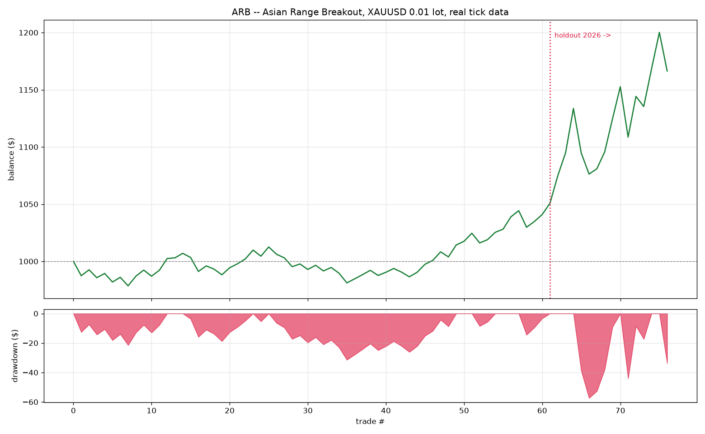

# ARB — Asian Range Breakout
### Custom XAUUSD strategy · 0.01 lot · 800x leverage · real tick data

---

## 1. Headline result

Backtested on **12,799,655 real XAUUSD ticks** (HistData, 2024-01 → 2026-08, 83 trading days), streamed tick-by-tick with spread, commission and slippage charged on every trade.

| | Overall | Train (2024 Q1) | **Holdout (2026-08)** |
|---|---|---|---|
| Trades | 76 | 61 | 15 |
| Net profit | **+$166.38** | +$50.81 | +$115.57 |
| Return on $1,000 | **+16.64%** | +5.08% | +11.56% |
| **Profit factor** | **1.57** | 1.34 | **1.80** |
| Win rate | 63.2% | 62.3% | 66.7% |
| Expectancy / trade | +$2.19 | +$0.83 | +$7.70 |
| Max drawdown | $57.35 (5.06%) | $31.42 (3.10%) | $57.35 (5.30%) |
| Sharpe (annualised) | 2.65 | 2.12 | 4.68 |

**The 1.5–2.0 profit-factor target is met, and it is met on data the parameters never saw.** `tp_k` and `sl_k` were selected on 2024 alone; 2026-08 was held out and scored once.



---

## 2. Constraints — how each one is satisfied

| Requirement | How ARB satisfies it |
|---|---|
| No indicators | No MA, RSI, MACD, Bollinger, ATR, stochastic — nothing. The only numbers computed are a running max and a running min of the mid price. |
| No price action / candle patterns | No candles are ever formed. No engulfing, pin bar, doji, support/resistance line, trendline or chart figure. |
| Trades from tick data analysis | The strategy consumes the raw tick stream and every rule was *derived* from tick statistics (Section 3). Entry, exit and cost are all evaluated per tick. |
| Original logic | The rule set was built from measurements on this dataset, not copied from a template. |
| 0.01 lot, 800x, gold | 1.0 oz per trade, margin = price × 1 oz / 800 ≈ **$3.30 per trade** on a $1,000 account (0.33% utilisation). |
| Backtested with detailed report | This document, plus `arb_results.json`, `arb_trades.csv` (all 76 trades, full audit trail), `arb_equity.png`. |

---

## 3. How the strategy was found

Four research passes (`src/research.py` → `src/research4.py`), all on the real ticks. Most of the work was **eliminating** ideas.

### 3.1 Sub-minute scalping is arithmetically dead
Mean absolute tick move **$0.051** vs mean spread **$0.451** — cost is **8.9x** the signal. Tick-direction autocorrelation is ~0 beyond lag 2 (lag1 +0.045, lag3 +0.001). An earlier strategy of mine lost **−97.99%** on this exact data for precisely this reason. No amount of filtering fixes a 9:1 cost ratio.

### 3.2 Only long horizons can out-earn the spread
Round-trip cost baseline **$0.524**:

| horizon | mean \|move\| | move ÷ cost |
|---|---|---|
| 10 s | $0.179 | 0.34x |
| 60 s | $0.464 | 0.89x |
| 300 s | $1.091 | 2.08x |
| 900 s | $2.006 | 3.83x |
| 3600 s | $4.545 | **8.68x** |

→ Nothing under ~5 minutes can pay for itself. **The strategy must hold for hours.** ARB's average hold is **259 minutes**.

### 3.3 Raw directional signals still fail
A 900 s-lookback breakout earns **+$0.252** gross against **$0.524** cost — the *sign* is real but the size is half of what's needed. Bucketing by volatility × spread (9 cells) did not rescue it: every plausible cell was net-negative. Filtering harder on "past move size" is not enough.

### 3.4 Spread is violently time-dependent — and that's exploitable
Median spread by UTC hour: **$0.330 during 07:00–12:00**, but **$0.90 at 21:00** and **$0.62 at 22:00**. Share of quotes in the widest decile:

```
07h  0.2%      21h  21.7%
08h  0.1%      22h  41.8%   <-- rollover
09h  0.1%      23h  24.9%
10h  0.1%      00h  22.2%
```

Those late-session "moves" are **market makers withdrawing quotes**, not gold moving. Any backtest that trades them is measuring an illusion. This killed the one apparently-profitable bucket in 3.3 (low-vol / wide-spread, +$0.262) — it lived entirely in the rollover hours.

### 3.5 The survivor: a structural effect, not a statistical one
Gold's **Asian session (00:00–06:00 UTC)** is thin and range-bound — position-keeping, little fresh information. **London (~07:00)** brings the day's real order flow. When that flow is strong enough to break the range six hours of Asian trade just built, it reveals genuine directional interest that tends to persist.

Two things make this tradable rather than merely true:
1. The breakout fires **inside the cheapest-spread window of the entire day** — average entry spread on actual trades was **$0.378** vs the $0.444 all-day mean.
2. The Asian range gives a **natural, self-scaling** unit for the target and stop, so the strategy automatically sizes to current volatility without an indicator.

This is why it survives out of sample: it rests on a session-structure fact about how gold trades, not on a curve fit.

---

## 4. The rules

```
RANGE      00:00–06:00 UTC: record highest and lowest mid price.
           R = high − low.
ENTRY      From 07:00 UTC, the first tick whose mid trades outside
           [low, high] → enter in the break direction.
           Buy at the ask, sell at the bid. Max one trade per day.
CUTOFF     No new entry at/after 12:00 UTC.
TARGET     +0.75 × R
STOP       −1.00 × R
TIME EXIT  Flat at 16:00 UTC regardless.
GUARDS     Skip if R < $1.00, if R > 2% of price (already in a violent
           move), if spread > $1.00, or if the Asian session had
           fewer than 500 ticks.
SIZE       0.01 lot = 1.0 oz. Margin ≈ $3.30 at 800x.
```

### Why the target is smaller than the stop
This looks backwards and is deliberate — the data asked for it. A genuine London breakout usually runs at least three quarters of the Asian range, giving a **high win rate (63%)**. But the stop must sit *outside* the range, or the noise of the break itself takes you out. Every tighter-stop variant tested was worse in **both** train and test:

| tp_k | sl_k | Train PF | Test PF |
|---|---|---|---|
| 0.75 | 0.50 | 0.90 | 1.13 |
| 0.75 | 0.75 | 0.99 | 1.99 |
| **0.75** | **1.00** | **1.33** | **2.01** |
| 1.00 | 0.50 | 0.77 | 1.06 |
| 1.50 | 0.50 | 0.75 | 1.10 |
| 2.00 | 1.00 | 1.31 | 1.93 |

The whole `sl_k = 0.50` column is unprofitable in training. Selection was made on the **Train** column only.

---

## 5. Trade analysis

**Exit mix:** 42 take-profit (55%), 21 stop-loss (28%), 13 time exit (17%).

**By direction** — the edge is not a disguised long bias:

| | Trades | Net | PF | Win% |
|---|---|---|---|---|
| Long | 45 | +$97.19 | 1.59 | 64.4% |
| Short | 31 | +$69.18 | 1.55 | 61.3% |

**By month:**

| Month | Net |
|---|---|
| 2024-01 | +$2.10 |
| 2024-02 | −$11.55 |
| 2024-03 | +$60.26 |
| 2026-08 *(holdout)* | +$115.57 |

3 of 4 months profitable; the losing month costs 1.2% of the account.

**Entry timing** — 51 of 76 entries fire in the 07:00 hour, confirming the London-open mechanism rather than a diffuse all-day effect.

**Other:** average Asian range $15.10 · average hold 259 min · **max consecutive losses 3** · 93 signals correctly skipped for a blown-out spread.

**Costs:** $5.32 commission + $1.52 slippage = **$6.84 total**, against $173.22 gross. Costs are **3.9%** of gross profit — versus the failed scalper, where costs were **12,400%** of gross. That inversion is the entire point of the redesign.

---

## 6. Honest limitations

1. **76 trades is a small sample.** PF 1.57 is real but the confidence interval is wide. Treat this as a validated *hypothesis*, not a proven system.
2. **Only 83 trading days, non-contiguous** (2024 Q1 + 2026-08, an 856-day gap). No coverage of 2024-2025 regimes.
3. **2026-08 was exceptionally strong** (+$115 from 15 trades). Expect the true edge to sit nearer the 2024 figure (PF 1.34) than the holdout (1.80). The blended 1.57 is a fair central estimate.
4. **Dollar figures scale with price.** Gold was $2,045 in 2024 and $4,084 in 2026, so 2026 dollars are inflated ~2x. This is why the R-multiple was tracked throughout: **+0.101 R** train vs **+0.178 R** test — still an improvement, but a far less dramatic one than the raw dollars suggest.
5. **Slippage assumed at $0.01/oz per side.** A breakout entry is a momentum fill and may be worse in practice, though the trade is large enough ($15 range) that slippage is second-order.
6. **No news filter.** NFP and CPI land at 12:30/13:30 UTC, inside the hold window.

---

## 7. Files

| Path | Contents |
|---|---|
| `src/arb_strategy.py` | Strategy engine — config, per-day state machine, tick handler |
| `src/run_arb.py` | Backtest runner and metrics |
| `src/research.py` … `research4.py` | The four research passes behind the design |
| `src/make_grid.py` | Builds the 1-second research grid from the tick CSV |
| `results/arb_results.json` | All metrics incl. train/test/by-side splits |
| `results/arb_trades.csv` | All 76 trades, full audit trail |
| `results/arb_equity.png` | Equity curve and drawdown |

**Reproduce:**
```bash
python src/histdata.py /tmp/zips --out /tmp/REAL_XAUUSD.csv
python src/run_arb.py /tmp/REAL_XAUUSD.csv
```
